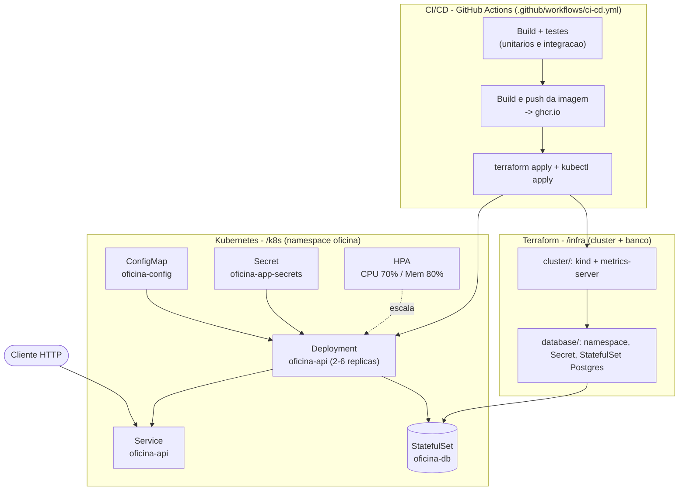

# Oficina API - Tech Challenge

Backend monolítico para gestão de Oficina Mecânica, desenvolvido com **Java 21 + Spring Boot 4 + PostgreSQL**.

## Fase 2 — objetivo desta fase

Na Fase 1 o foco foi o domínio (OS, clientes, veículos, peças). Nesta Fase 2 o
objetivo é evoluir a base para suportar **maior demanda e múltiplas unidades**
com resiliência e escalabilidade, incorporando:

- Containerização revisada (Docker/Docker Compose).
- Orquestração via Kubernetes (Deployments, Services, ConfigMaps/Secrets, HPA).
- Infraestrutura como código via Terraform (cluster + banco de dados).
- Pipeline de CI/CD (build, testes, imagem Docker, deploy no cluster).

A seção [Infraestrutura e Deploy](#infraestrutura-e-deploy) detalha os
componentes provisionados e como executar cada etapa.

---

## Pré-requisitos

- Java 21+
- Docker e Docker Compose
- Maven (ou use o wrapper `./mvnw` incluso no projeto)

---

## Subindo o ambiente

### 0. (Opcional) Customizar credenciais locais

```bash
cp .env.example .env
```

O `docker-compose.yml` lê as variáveis do `.env` (se não existir, usa os
defaults abaixo). O `.env` é ignorado pelo git.

### 1. Iniciar o banco de dados

```bash
docker-compose up -d db
```

Isso sobe um container PostgreSQL com as credenciais padrão:
- **Host:** `localhost:5432`
- **Banco:** `oficina_db`
- **Usuário:** `oficina_user`
- **Senha:** `oficina_123`

### 2. Iniciar a aplicação

```bash
./mvnw spring-boot:run
```

Alternativamente, `docker-compose up -d` sobe banco **e** aplicação
containerizados (usa o `Dockerfile` multi-stage do projeto).

O Flyway executa as migrations automaticamente na inicialização. A aplicação fica disponível em `http://localhost:8080`.

---

## Usando o Swagger

Com a aplicação rodando, acesse:

**http://localhost:8080/swagger-ui/index.html**

Todos os endpoints (exceto `/api/auth/**`) exigem autenticação JWT. Para usar o Swagger:

**Passo 1 — Criar um usuário**

Localize o endpoint `POST /api/auth/register` e execute com:
```json
{
  "email": "admin@oficina.com",
  "senha": "123456"
}
```

**Passo 2 — Fazer login**

Execute `POST /api/auth/login` com as mesmas credenciais. Copie o valor do campo `token` da resposta.

**Passo 3 — Autorizar no Swagger**

1. Clique no botão **Authorize** (cadeado no topo da página)
2. No campo **bearerAuth**, cole o token copiado (apenas o valor, sem o prefixo `Bearer`)
3. Clique em **Authorize** e depois **Close**

A partir deste passo todos os endpoints enviam o JWT automaticamente.

---

## Testando via Insomnia

Importe o arquivo `tests/oficina-api.insomnia.json` no Insomnia.

Configure as variáveis de ambiente da collection:
| Variável | Valor padrão | Descrição |
|---|---|---|
| `base_url` | `http://localhost:8080` | URL base da API |
| `token` | _(vazio)_ | Token JWT — preencher após login |
| `cliente_id` | _(vazio)_ | UUID do cliente cadastrado |
| `veiculo_placa` | `ABC1D23` | Placa para testes |
| `numero_os` | _(vazio)_ | Número da OS criada |
| `numero_orcamento` | _(vazio)_ | Número do orçamento criado |

**Fluxo sugerido:**
1. `POST /api/auth/register` — criar usuário
2. `POST /api/auth/login` — copiar o token para a variável `token`
3. `POST /clientes` — criar cliente, copiar o `id` para `cliente_id`
4. `POST /veiculos` — criar veículo vinculado ao cliente
5. `POST /ordens-servico` — abrir OS, copiar o número para `numero_os`
6. Avançar o fluxo da OS (iniciar diagnóstico → concluir → enviar para orçamento)

---

## Executando os testes

### Testes unitários e de controller

```bash
./mvnw test
```

Utilizam **H2 in-memory** — não é necessário banco externo. Cobertura mínima de 80% (linhas e branches) é verificada pelo JaCoCo. O build falha se a cobertura não for atingida.

### Testes de integração (PostgreSQL real)

Exigem o banco rodando (`docker-compose up -d db`).

```bash
./mvnw test -Dspring.profiles.active=integration
```

Os testes de integração validam os repositórios JPA contra o PostgreSQL real e usam `@Transactional` com rollback automático — nenhum dado persiste entre testes.

### Build completo com relatório de cobertura

```bash
./mvnw verify
```

O relatório HTML é gerado em `target/site/jacoco/index.html`.

---

## Scan de Vulnerabilidades e Qualidade (SonarQube)

O projeto está configurado para consolidar a cobertura de testes do JaCoCo e inspecionar a qualidade do código (code smells, bugs e vulnerabilidades) via **SonarQube**.

**Como executar a varredura:**

1. Certifique-se de que possui um servidor SonarQube rodando. Caso não possua, você pode subir um localmente usando Docker:
   ```bash
   docker run -d --name sonarqube -p 9000:9000 sonarqube:latest
   ```

2. Execute o build junto com os testes para que os relatórios do XML de cobertura do JaCoCo sejam criados (localizados na pasta do `target`):
   ```bash
   ./mvnw clean verify
   ```

3. Dispare a execução do *Sonar Scanner* passando a URL e as credenciais do seu servidor. **Atenção:** Se estiver usando o **PowerShell** no Windows, coloque os parâmetros com `-D` entre aspas para evitar erros de leitura, como no exemplo abaixo:
   ```bash
   ./mvnw sonar:sonar "-Dsonar.host.url=http://localhost:9000" "-Dsonar.token=SEU_TOKEN" "-Dsonar.projectKey=oficina"
   ```

Acesse o painel do seu SonarQube na URL do host para visualizar o nível de cobertura, a aba de "Security" e demais métricas de vulnerabilidade do projeto.

---

## Autenticação JWT

Todas as rotas exceto `/api/auth/register` e `/api/auth/login` exigem o header:

```
Authorization: Bearer <token>
```

O token expira em **24 horas**. Para renovar, basta fazer login novamente.

---

## Estrutura do projeto

```
src/main/java/br/com/oficina/
├── auth/               # JWT stateless — register, login, filtro, SecurityConfig
├── cliente/            # CRUD de clientes (PF/PJ, validacao CPF/CNPJ)
├── veiculo/            # CRUD de veiculos (placa formato antigo e Mercosul)
├── ordemservico/       # Bounded context principal — ciclo de vida da OS
├── orcamento/          # Orcamentos vinculados a OS
├── pecainsumo/         # Estoque de pecas e insumos
├── common/             # Excecoes globais e ApiExceptionHandler
└── config/             # SwaggerConfig, FlywayConfig
```

Arquitetura hexagonal (ports & adapters) com estrutura `domain / application / infrastructure` por módulo.

---

## Infraestrutura e Deploy

### Desenho da arquitetura



**Componentes da aplicação:** API Spring Boot (`oficina-api`, arquitetura
hexagonal — ver [Estrutura do projeto](#estrutura-do-projeto)) + PostgreSQL.

**Infraestrutura provisionada:** cluster Kubernetes (kind local, via
Terraform), namespace `oficina`, banco PostgreSQL como `StatefulSet` com
volume persistente, e a API como `Deployment` com 2-6 réplicas controladas
por HPA.

**Fluxo de deploy:** push/PR em `master` → build + testes (unitário e
integração) → build e push da imagem para o GHCR → `terraform apply`
provisiona cluster + banco → `kubectl apply -f k8s/` sobe a API apontando
para a imagem recém publicada.

### Containerização (Docker)

- `Dockerfile`: build multi-stage (Maven → JRE Alpine), usuário não-root,
  `HEALTHCHECK` via `/v3/api-docs` (endpoint público do Swagger, não exige JWT).
- `docker-compose.yml`: sobe banco + aplicação para desenvolvimento local
  (ver [Subindo o ambiente](#subindo-o-ambiente)).

### Kubernetes (`/k8s`)

| Arquivo | Recurso |
|---|---|
| `01-configmap.yaml` | `DB_URL` (aponta para o Service do Postgres criado pelo Terraform) |
| `02-secret.yaml` | `JWT_SECRET` (valor de demo — ver comentário no arquivo) |
| `03-deployment.yaml` | Deployment da API, 2 réplicas, probes de readiness/liveness, requests/limits de CPU e memória |
| `04-service.yaml` | Service `ClusterIP` |
| `05-hpa.yaml` | HorizontalPodAutoscaler (2-6 réplicas, 70% CPU / 80% memória) |

As credenciais do banco (`DB_USER`/`DB_PASS`) **não** estão em `/k8s` — vêm do
Secret `oficina-db-credentials`, criado pelo Terraform (`infra/database`),
já que o mesmo Terraform provisiona o banco. Por isso a ordem de aplicação
importa: **Terraform primeiro, manifestos do `/k8s` depois.**

```bash
# depois de aplicar infra/cluster e infra/database (ver secao seguinte)
export KUBECONFIG="$(pwd)/infra/cluster/kubeconfig"   # PowerShell: $env:KUBECONFIG = "$PWD/infra/cluster/kubeconfig"

# se o pacote ghcr.io/gustav13/oficina for privado, crie o pull secret antes do apply
# (a pipeline de CI/CD faz isso automaticamente com o GITHUB_TOKEN)
kubectl create secret docker-registry ghcr-pull-secret \
  --namespace oficina \
  --docker-server=ghcr.io \
  --docker-username=<seu_usuario_github> \
  --docker-password=<um_PAT_com_scope_read:packages>

kubectl apply -f k8s/
kubectl -n oficina rollout status deployment/oficina-api
kubectl -n oficina port-forward svc/oficina-api 8080:80   # acesso local em http://localhost:8080
```

### Infraestrutura como código (Terraform, `/infra`)

Detalhes completos, recursos criados e como apontar para um cluster cloud em
vez do kind local: [`infra/README.md`](infra/README.md).

```bash
cd infra/cluster && terraform init && terraform apply -auto-approve
cd ../database    && terraform init && terraform apply -auto-approve
```

### CI/CD (`.github/workflows/ci-cd.yml`)

Pipeline no GitHub Actions, disparada em push/PR para `master`:

1. **unit-tests** — `./mvnw clean verify` (build + testes unitários + gate de cobertura JaCoCo).
2. **integration-tests** — `./mvnw test -Dspring.profiles.active=integration` contra um PostgreSQL real (service container).
3. **build-image** — build e push da imagem para `ghcr.io/gustav13/oficina` (tags por SHA e `latest`).
4. **deploy** — provisiona um cluster kind efêmero + banco via Terraform e aplica os manifestos de `/k8s`, validando o rollout (`kubectl rollout status`) — só roda em push a `master` ou `workflow_dispatch`, nunca em PR.

## Variáveis de ambiente

| Variável | Padrão |
|---|---|
| `DB_URL` | `jdbc:postgresql://localhost:5432/oficina_db` |
| `DB_USER` | `oficina_user` |
| `DB_PASS` | `oficina_123` |
| `JWT_SECRET` | chave hardcoded de fallback |
