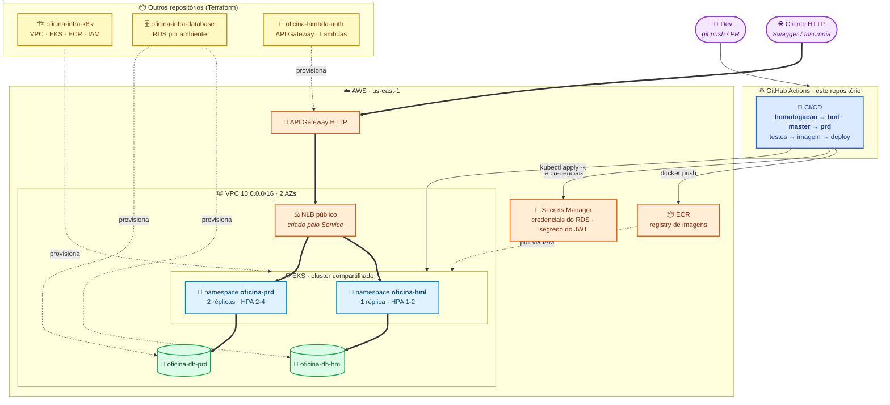

# Oficina API - Tech Challenge

Backend monolítico para gestão de Oficina Mecânica, desenvolvido com **Java 21 + Spring Boot 4 + PostgreSQL**.

## Fase 3 — objetivo desta fase

A Fase 2 entregou containerização, Kubernetes na AWS, Terraform e CI/CD — tudo
num repositório só. A Fase 3 eleva o projeto a operação corporativa e, para
isso, **separa o sistema em quatro repositórios independentes**, cada um com
seu próprio CI/CD e deploy automático para a nuvem:

| Repositório | Responsabilidade |
|---|---|
| **`oficina-app`** (este) | API Spring Boot, manifestos Kubernetes e deploy no EKS |
| `oficina-infra-k8s` | VPC, cluster EKS, ECR e IAM/IRSA (Terraform) |
| `oficina-infra-database` | RDS PostgreSQL, uma instância por ambiente (Terraform) |
| `oficina-lambda-auth` | API Gateway e a Function Serverless de autenticação por CPF |

Duas mudanças importantes neste repositório:

- **`infra/` deixou de existir aqui.** Todo o Terraform migrou para os dois
  repositórios de infraestrutura. O que ficou é a aplicação e a forma de
  implantá-la.
- **Dois ambientes**, no mesmo cluster e separados por namespace:
  `oficina-hml` (branch `homologacao`) e `oficina-prd` (branch `master`),
  cada um com seu próprio banco de dados e seus próprios segredos.

A seção [Infraestrutura e Deploy](#infraestrutura-e-deploy) detalha os
componentes e como executar cada etapa.

---

## Pré-requisitos

- Java 21+
- Docker e Docker Compose
- Maven (ou use o wrapper `./mvnw` incluso no projeto)

---

## Subindo o ambiente

### 0. (Opcional) Customizar credenciais locais

```bash
cp .env.example .env
```

O `docker-compose.yml` lê as variáveis do `.env` (se não existir, usa os
defaults abaixo). O `.env` é ignorado pelo git.

### 1. Iniciar o banco de dados

```bash
docker-compose up -d db
```

Isso sobe um container PostgreSQL com as credenciais padrão:
- **Host:** `localhost:5432`
- **Banco:** `oficina_db`
- **Usuário:** `oficina_user`
- **Senha:** `oficina_123`

### 2. Iniciar a aplicação

```bash
./mvnw spring-boot:run
```

Alternativamente, `docker-compose up -d` sobe banco **e** aplicação
containerizados (usa o `Dockerfile` multi-stage do projeto).

O Flyway executa as migrations automaticamente na inicialização. A aplicação fica disponível em `http://localhost:8080`.

### 3. (Opcional) Visualizar e-mails com o Mailhog

O `docker-compose.yml` também sobe um serviço `mailhog` — um servidor SMTP
falso para desenvolvimento local. Ele **não envia e-mails de verdade**: toda
notificação disparada pela aplicação (via outbox, a cada mudança de status da
OS) é capturada por ele e exibida em uma UI web, em vez de ir para uma caixa
de entrada real.

> Mailhog/SMTP é usado apenas em desenvolvimento local. Em produção o envio
> de e-mail usa Amazon SES via o profile `ses` — ver
> [Configuração de e-mail em produção (Amazon SES)](#configuração-de-e-mail-em-produção-amazon-ses).

```bash
docker-compose up -d mailhog
```

- **SMTP (usado pela aplicação):** `localhost:1025` — já é o default de
  `SMTP_HOST`/`SMTP_PORT` no `application.yml`, então nenhuma configuração
  extra é necessária.
- **UI web (para inspecionar os e-mails capturados):** http://localhost:8025

Para testar: dispare qualquer ação que gere notificação (ex.: uma mudança de
status de OS) e abra a UI do Mailhog em `http://localhost:8025` — o e-mail
capturado aparece na lista, com assunto, corpo e destinatário, sem precisar de
nenhuma conta de e-mail real.

### 4. (Opcional) Testando o fluxo de e-mail passo a passo (via curl)

Roteiro completo para disparar manualmente as notificações de mudança de
status da OS e conferir, pela API do Mailhog, que cada mudança gera
**exatamente um** e-mail (regressão a evitar: notificação duplicada quando
duas situações internas da OS mapeiam para o mesmo status externo, ex.
`DIAGNOSTICO_EM_ANDAMENTO` e `DIAGNOSTICO_CONCLUIDO` → "Diagnóstico").

Pré-requisitos: banco, aplicação (passos 1-2) e Mailhog (passo 3) no ar.
Requer `jq` (`brew install jq`).

```bash
BASE_URL=http://localhost:8080
MAILHOG_API=http://localhost:8025/api

# 1. Registrar usuário e autenticar
TOKEN=$(curl -s -X POST $BASE_URL/api/auth/register \
  -H "Content-Type: application/json" \
  -d '{"email":"teste@oficina.com","senha":"senha123"}' | jq -r .token)

# 2. Cadastrar cliente — o e-mail informado aqui recebe as notificações
CLI_ID=$(curl -s -X POST $BASE_URL/clientes \
  -H "Authorization: Bearer $TOKEN" -H "Content-Type: application/json" \
  -d '{"nome":"Cliente Teste","cpfOuCnpj":"12345678909","tipoCliente":"PF","email":"cliente@mailhog.local"}' \
  | jq -r .id)

# 3. Cadastrar funcionário
FUNC_ID=$(curl -s -X POST $BASE_URL/funcionarios \
  -H "Authorization: Bearer $TOKEN" -H "Content-Type: application/json" \
  -d '{"nome":"Funcionario Teste","cpf":"98765432100"}' \
  | jq -r .id)

# 4. Cadastrar veículo vinculado ao cliente
curl -s -X POST $BASE_URL/veiculos \
  -H "Authorization: Bearer $TOKEN" -H "Content-Type: application/json" \
  -d "{\"placa\":\"TST1E23\",\"marca\":\"Toyota\",\"modelo\":\"Corolla\",\"fabricante\":\"Toyota Motor Corporation\",\"ano\":2024,\"potencia\":177,\"cambio\":\"AUTOMATICO\",\"tipo\":\"FLEX\",\"clienteId\":\"$CLI_ID\"}" > /dev/null

# 5. Abrir a OS
OS=$(curl -s -X POST $BASE_URL/ordens-servico \
  -H "Authorization: Bearer $TOKEN" -H "Content-Type: application/json" \
  -d "{\"clienteId\":\"$CLI_ID\",\"funcionarioId\":\"$FUNC_ID\",\"placaVeiculo\":\"TST1E23\"}" \
  | jq -r .numeroOrdemServico)
echo "OS criada: $OS"

# 6. Limpar a caixa do Mailhog antes de testar
curl -s -X DELETE $MAILHOG_API/v1/messages

# 7. Avançar o status da OS — cada chamada abaixo deve gerar 1 e-mail
curl -s -o /dev/null -w "iniciar diagnostico: %{http_code}\n" \
  -X POST $BASE_URL/ordens-servico/$OS/diagnostico/iniciar -H "Authorization: Bearer $TOKEN"
curl -s -o /dev/null -w "concluir diagnostico: %{http_code}\n" \
  -X POST $BASE_URL/ordens-servico/$OS/diagnostico/concluir -H "Authorization: Bearer $TOKEN"

# 8. Conferir os e-mails capturados
curl -s $MAILHOG_API/v2/messages | jq '{total, assuntos: [.items[].Content.Headers.Subject[0]]}'
```

Abra também `http://localhost:8025` para inspecionar o corpo de cada e-mail.

**O que verificar:**
- Cada chamada que muda a `situacao` da OS deve gerar **exatamente um**
  e-mail com assunto `Atualizacao da ordem de servico <numero>`.
- Chamadas que não mudam a `situacao` (ex.: transições internas que mapeiam
  para o mesmo status externo) **não** devem gerar e-mail novo — se
  gerarem, é regressão do bug corrigido em `ConcluirDiagnosticoService`
  (o evento só é publicado quando `situacaoAnterior != situacaoAtual`).
- Para repetir o teste em outra OS, refaça os passos 5-8 (ou apenas o
  passo 5 se cliente/funcionário/veículo já existirem).

---

## Usando o Swagger

Com a aplicação rodando, acesse:

**http://localhost:8080/swagger-ui/index.html**

Todos os endpoints (exceto `/api/auth/**`) exigem autenticação JWT. Para usar o Swagger:

**Passo 1 — Criar um usuário**

Localize o endpoint `POST /api/auth/register` e execute com:
```json
{
  "email": "admin@oficina.com",
  "senha": "123456"
}
```

**Passo 2 — Fazer login**

Execute `POST /api/auth/login` com as mesmas credenciais. Copie o valor do campo `token` da resposta.

**Passo 3 — Autorizar no Swagger**

1. Clique no botão **Authorize** (cadeado no topo da página)
2. No campo **bearerAuth**, cole o token copiado (apenas o valor, sem o prefixo `Bearer`)
3. Clique em **Authorize** e depois **Close**

A partir deste passo todos os endpoints enviam o JWT automaticamente.

---

## Testando via Insomnia

Importe o arquivo `tests/oficina-api.insomnia.json` no Insomnia.

Configure as variáveis de ambiente da collection:
| Variável | Valor padrão | Descrição |
|---|---|---|
| `base_url` | `http://localhost:8080` | URL base da API |
| `token` | _(vazio)_ | Token JWT — preencher após login |
| `cliente_id` | _(vazio)_ | UUID do cliente cadastrado |
| `veiculo_placa` | `ABC1D23` | Placa para testes |
| `numero_os` | _(vazio)_ | Número da OS criada |
| `numero_orcamento` | _(vazio)_ | Número do orçamento criado |

**Fluxo sugerido:**
1. `POST /api/auth/register` — criar usuário
2. `POST /api/auth/login` — copiar o token para a variável `token`
3. `POST /clientes` — criar cliente, copiar o `id` para `cliente_id`
4. `POST /veiculos` — criar veículo vinculado ao cliente
5. `POST /ordens-servico` — abrir OS, copiar o número para `numero_os`
6. Avançar o fluxo da OS (iniciar diagnóstico → concluir → enviar para orçamento)

---

## Executando os testes

```bash
./mvnw test
```

Esse comando roda toda a suíte. Cobertura mínima de 80% (linhas e branches) é verificada pelo JaCoCo. O build falha se a cobertura não for atingida.

### Testes unitários e de controller

Utilizam **H2 in-memory** — não exigem banco externo nem Docker.

### Testes de integração (PostgreSQL real via Testcontainers)

Os testes `*IntegrationTest` validam os repositórios JPA contra um **PostgreSQL real provisionado automaticamente pelo [Testcontainers](https://testcontainers.com/)**. Basta ter o **Docker em execução** — não é necessário subir o banco manualmente (`docker-compose`) nem apontar para um banco externo em `localhost`. O container é efêmero e descartado ao fim da execução, garantindo que os testes rodem em qualquer máquina/CI com Docker.

Detalhes:
- A classe base `PostgresIntegrationTest` (em `src/test/.../support`) sobe o container `postgres:16-alpine` e injeta o datasource via `@ServiceConnection`.
- Os testes usam `@Transactional` com rollback automático — nenhum dado persiste entre testes.
- Sem Docker disponível, apenas os testes de integração falham ao iniciar o container; os demais continuam rodando normalmente.

### Build completo com relatório de cobertura

```bash
./mvnw verify
```

O relatório HTML é gerado em `target/site/jacoco/index.html`.

---

## Scan de Vulnerabilidades e Qualidade (SonarQube)

O projeto está configurado para consolidar a cobertura de testes do JaCoCo e inspecionar a qualidade do código (code smells, bugs e vulnerabilidades) via **SonarQube**.

**Como executar a varredura:**

1. Certifique-se de que possui um servidor SonarQube rodando. Caso não possua, você pode subir um localmente usando Docker:
   ```bash
   docker run -d --name sonarqube -p 9000:9000 sonarqube:latest
   ```

2. Execute o build junto com os testes para que os relatórios do XML de cobertura do JaCoCo sejam criados (localizados na pasta do `target`):
   ```bash
   ./mvnw clean verify
   ```

3. Dispare a execução do *Sonar Scanner* passando a URL e as credenciais do seu servidor. **Atenção:** Se estiver usando o **PowerShell** no Windows, coloque os parâmetros com `-D` entre aspas para evitar erros de leitura, como no exemplo abaixo:
   ```bash
   ./mvnw sonar:sonar "-Dsonar.host.url=http://localhost:9000" "-Dsonar.token=SEU_TOKEN" "-Dsonar.projectKey=oficina"
   ```

Acesse o painel do seu SonarQube na URL do host para visualizar o nível de cobertura, a aba de "Security" e demais métricas de vulnerabilidade do projeto.

---

## Autenticação JWT

Todas as rotas exceto `/api/auth/register` e `/api/auth/login` exigem o header:

```
Authorization: Bearer <token>
```

O token expira em **24 horas**. Para renovar, basta fazer login novamente.

---

## Endpoints REST

| Domínio | Endpoints |
|---|---|
| Autenticação (`/api/auth`) | `POST /register`, `POST /login` |
| Clientes (`/clientes`) | `POST`, `GET`, `GET /{clienteId}`, `PUT /{clienteId}`, `DELETE /{clienteId}` |
| Veículos (`/veiculos`) | `POST`, `GET`, `PUT /{placa}`, `DELETE /{placa}` |
| Funcionários (`/funcionarios`) | `POST`, `GET`, `GET /{funcionarioId}`, `PUT /{funcionarioId}`, `DELETE /{funcionarioId}` |
| Ordens de Serviço (`/ordens-servico`) | `POST`, `GET`, `GET /{numeroOrdemServico}`, `PUT /{numeroOrdemServico}`, `DELETE /{numeroOrdemServico}`, `GET /metricas/tempo-medio`, `GET /{numeroOrdemServico}/acompanhamento` |
| Diagnóstico da OS | `POST /ordens-servico/{numeroOrdemServico}/diagnostico/iniciar`, `POST /ordens-servico/{numeroOrdemServico}/diagnostico/concluir`, `POST /ordens-servico/{numeroOrdemServico}/diagnostico/enviar-para-orcamento` |
| Execução e entrega da OS | `POST /ordens-servico/{numeroOrdemServico}/execucao/iniciar`, `POST /ordens-servico/{numeroOrdemServico}/servico/concluir`, `POST /ordens-servico/{numeroOrdemServico}/finalizacao`, `POST /ordens-servico/{numeroOrdemServico}/entrega` |
| Orçamentos (`/orcamentos`) | `POST /{orcamentoId}/aprovacao`, `POST /{orcamentoId}/rejeicao`, `GET /{orcamentoId}`, `GET`, `PUT /{orcamentoId}`, `DELETE /{orcamentoId}` |
| Peças e Insumos (`/pecas-insumos`) | `POST`, `GET`, `GET /{id}`, `PUT /{id}`, `DELETE /{id}`, `POST /{id}/adicionar-estoque`, `POST /{id}/remover-estoque`, `POST /{id}/reservar`, `POST /{id}/liberar-reserva`, `POST /{id}/consumir` |
| Webhook de decisão de orçamento (`/integracoes/orcamentos`) | `POST /{numeroOrcamento}/decisao` — exige o header `X-Webhook-Token`, aceitando um token de integração gerado (ver abaixo) ou o segredo estático `ORCAMENTO_WEBHOOK_SECRET` (coexistência temporária) |
| Tokens de integração (`/integracoes/tokens`) | `POST` (gerar), `GET` (listar), `DELETE /{id}` (revogar) — autenticado via JWT, como as demais rotas |

> **Notificações**: não expõem endpoint REST. São disparadas internamente (padrão outbox) a cada mudança de status da OS e reprocessadas por um scheduler em caso de falha de envio. O transporte de e-mail é resolvido por Spring Profile: SMTP/Mailhog (`SMTP_HOST`/`SMTP_PORT`, default) em desenvolvimento, ou Amazon SES com o profile `ses` em produção — ver [Configuração de e-mail em produção (Amazon SES)](#configuração-de-e-mail-em-produção-amazon-ses).

---

## Estrutura do projeto

```
src/main/java/br/com/oficina/
├── auth/               # JWT stateless — register, login, filtro, SecurityConfig
├── cliente/            # CRUD de clientes (PF/PJ, validacao CPF/CNPJ)
├── veiculo/            # CRUD de veiculos (placa formato antigo e Mercosul)
├── ordemservico/       # Bounded context principal — ciclo de vida da OS
├── orcamento/          # Orcamentos vinculados a OS
├── pecainsumo/         # Estoque de pecas e insumos
├── common/             # Excecoes globais e ApiExceptionHandler
└── config/             # SwaggerConfig, FlywayConfig
```

Arquitetura hexagonal (ports & adapters) com estrutura `domain / application / infrastructure` por módulo.

---

## Infraestrutura e Deploy

### Desenho da arquitetura



**O que este repositório entrega:** a API Spring Boot (`oficina-api`,
arquitetura hexagonal — ver [Estrutura do projeto](#estrutura-do-projeto)), a
imagem Docker e os manifestos Kubernetes de cada ambiente.

**O que vem de fora:** cluster, registry e IAM (`oficina-infra-k8s`), bancos
(`oficina-infra-database`) e o gateway com a autenticação
(`oficina-lambda-auth`). Todos precisam estar aplicados **antes** do primeiro
deploy de um ambiente — a pipeline falha com mensagem explícita se o banco
daquele ambiente não existir.

**Fluxo de deploy:** push em `homologacao` ou `master` → build + testes
(unitário e integração) + validação dos overlays → imagem publicada no **ECR**
(tag `<ambiente>-<sha>`) → o job de deploy aponta o `kubectl` para o EKS,
descobre o endpoint do RDS daquele ambiente, materializa os Secrets a partir do
**Secrets Manager**, preenche o overlay e aplica com `kubectl apply -k`,
aguardando o rollout e confirmando com um healthcheck real pelo NLB.

### Containerização (Docker)

- `Dockerfile`: build multi-stage (Maven → JRE 21 Alpine), usuário não-root,
  `HEALTHCHECK` via `/actuator/health/liveness` (Spring Boot Actuator, público).
- `docker-compose.yml`: sobe banco + aplicação para desenvolvimento local
  (ver [Subindo o ambiente](#subindo-o-ambiente)).

### Kubernetes (`/k8s`) — base + overlays por ambiente

Os manifestos usam **Kustomize** (embutido no `kubectl`, sem ferramenta extra):
uma base comum e um overlay por ambiente.

```
k8s/
├── base/                    comum aos dois ambientes
│   ├── serviceaccount.yaml  ServiceAccount oficina-api (IRSA para SES)
│   ├── deployment.yaml      Deployment, probes Actuator, envFrom/secretKeyRef
│   ├── service.yaml         Service LoadBalancer (NLB público)
│   └── hpa.yaml             HPA por CPU 70% / memória 80%
└── overlays/
    ├── hml/                 namespace oficina-hml
    └── prd/                 namespace oficina-prd
```

Cada overlay define, além do namespace:

| Arquivo | Para que serve |
|---|---|
| `namespace.yaml` | O namespace do ambiente |
| `resourcequota.yaml` | Cota de CPU/memória/pods — impede que um ambiente consuma o cluster e derrube o outro |
| `app.env` | Variáveis não sensíveis. Vira ConfigMap **com sufixo de hash**, então mudar configuração dispara rolling update sozinho |
| `patch-deployment.yaml` | Réplicas e `requests`/`limits` do ambiente |
| `patch-hpa.yaml` | Faixa de escala (hml 1–2, prd 2–4) |
| `patch-serviceaccount.yaml` | Anotação `eks.amazonaws.com/role-arn` para IRSA |

```bash
kubectl kustomize k8s/overlays/hml    # renderiza sem aplicar
kubectl apply -k k8s/overlays/prd     # aplica
```

**Nenhum segredo é versionado.** Os dois Secrets são criados pela pipeline, a
cada deploy:

| Secret | Origem |
|---|---|
| `oficina-db-credentials` | Secrets Manager, gerenciado pelo próprio RDS |
| `oficina-app-secrets` | `JWT_SECRET` vem de `oficina/<ambiente>/jwt-secret` (criado por `oficina-lambda-auth` — é o mesmo segredo que assina o token); `ORCAMENTO_WEBHOOK_SECRET` vem do secret de repositório de mesmo nome |

Três marcadores (`__IMAGE_REPO__`, `__IMAGE_TAG__`, `__SES_IAM_ROLE_ARN__`) são
preenchidos pela pipeline; os comandos para preenchê-los à mão estão comentados
nos próprios arquivos.

### Infraestrutura como código (Terraform)

**Não fica mais neste repositório.** Provisionamento, custos, bootstrap do state
no S3 e ordem de apply/destroy estão nos READMEs de:

- **`oficina-infra-k8s`** — VPC, EKS, ECR, IAM/IRSA. Aplique **primeiro**.
- **`oficina-infra-database`** — RDS `oficina-db-hml` e `oficina-db-prd`.
- **`oficina-lambda-auth`** — API Gateway e Lambdas de autenticação.

> ⚠️ Custo do ambiente completo: **~US$ 6,30/dia** com tudo ligado. Aplique
> quando for usar e destrua depois, **na ordem inversa** (lambda → banco →
> plataforma).

### CI/CD (`.github/workflows/`)

**Secrets/variables do repositório** (Settings → Secrets and variables → Actions):

| Tipo | Nome | Obrigatório |
|---|---|---|
| Secret | `AWS_ACCESS_KEY_ID` / `AWS_SECRET_ACCESS_KEY` | sim |
| Secret | `ORCAMENTO_WEBHOOK_SECRET` | não — se ausente, o valor já aplicado é preservado |
| Variable | `AWS_SES_REMETENTE` | sim — endereço verificado no SES |
| Variable | `AWS_REGION` | não (default `us-east-1`) |

**`ci-cd.yml` — CI/CD**

| Gatilho | O que roda |
|---|---|
| PR e push em `desenvolvimento` | Testes unitários, de integração e validação dos overlays |
| **Push em `homologacao`** | Tudo acima → imagem `hml-<sha>` no ECR → **deploy em `oficina-hml`** |
| **Push em `master`** | Tudo acima → imagem `prd-<sha>` no ECR → **deploy em `oficina-prd`** |

Jobs:

1. **unit-tests** — `./mvnw clean verify` (build + testes unitários + gate de cobertura JaCoCo).
2. **integration-tests** — `./mvnw test -Dspring.profiles.active=integration` contra um PostgreSQL real (service container).
3. **manifests** — `kubectl kustomize` dos dois overlays; um erro de Kustomize só apareceria no deploy sem este job.
4. **build-image** — build e push para o **ECR** com as tags `<ambiente>-<sha>` e `<ambiente>-latest`; só em push nas branches de ambiente, nunca em PR.
5. **deploy** — descobre RDS e IAM Role, cria os Secrets, preenche e aplica o overlay, aguarda o rollout e faz um **healthcheck real pelo NLB** (um pod pode ficar `Ready` antes de o NLB registrar os alvos).

Os jobs de deploy usam GitHub **Environments** (`homologacao` / `producao`), o
que permite exigir aprovação manual antes de produção sem alterar o YAML.

**`pr-source-guard.yml`** — reprova PR cuja branch de origem não segue o fluxo
`feature/*` → `desenvolvimento` → `homologacao` → `master`. Marque o job `guard`
como *status check* obrigatório na proteção de `master` e `homologacao`.

> Mudança em relação à Fase 2: `master` deixou de aceitar PR direto de
> `desenvolvimento`. Como `homologacao` agora tem deploy automático próprio,
> nada chega em produção sem ter passado por homologação.

## Variáveis de ambiente

| Variável | Padrão |
|---|---|
| `DB_URL` | `jdbc:postgresql://localhost:5432/oficina_db` |
| `DB_USER` | `oficina_user` |
| `DB_PASS` | `oficina_123` |
| `JWT_SECRET` | chave hardcoded de fallback |
| `SPRING_PROFILES_ACTIVE` | não definido (SMTP/Mailhog); `ses` ativa o envio via Amazon SES em produção |
| `AWS_SES_REGION` | *(apenas com profile `ses`)* região AWS do SES, ex. `us-east-1` |
| `AWS_SES_REMETENTE` | *(apenas com profile `ses`)* endereço remetente, já verificado no SES |

## Configuração de e-mail em produção (Amazon SES)

Nos ambientes de nuvem (Kubernetes, `k8s/`), o envio de e-mail é feito por `NotificadorEmailSes`,
ativado pelo Spring Profile `ses` (ver `SPRING_PROFILES_ACTIVE` em
[`k8s/base/deployment.yaml`](k8s/base/deployment.yaml)). Em desenvolvimento local
(`docker-compose.yml`) esse profile não é definido e a aplicação continua usando
`NotificadorEmailSpringMail` contra o Mailhog — nenhum dos dois ambientes precisa
de configuração adicional para manter seu comportamento atual.

**Variáveis do profile `ses`:**

- `AWS_SES_REGION` — região AWS do SES (ex. `us-east-1`), definida no `app.env` do overlay do ambiente (`k8s/overlays/<hml|prd>/app.env`).
- `AWS_SES_REMETENTE` — endereço de e-mail remetente. **Não é versionado**: a pipeline acrescenta essa linha ao `app.env` a partir da variável de repositório `AWS_SES_REMETENTE` no momento do deploy.

**Pré-requisitos antes do primeiro deploy do profile `ses`:**

1. **Verificação de domínio ou endereço no console do Amazon SES** — o remetente que for
   configurado em `AWS_SES_REMETENTE` (passo 3 abaixo) precisa estar verificado na conta AWS/região
   usada (`us-east-1`); sem isso o SES rejeita o envio. Esta é uma ação manual no console AWS, fora
   deste repositório.
2. **Decisão sandbox vs. saída do sandbox** — contas novas do SES operam em modo sandbox (só
   enviam para endereços/domínios *também* verificados). Para testar, use o
   [mailbox simulator do SES](https://docs.aws.amazon.com/ses/latest/dg/send-an-email-from-console.html#send-email-simulator)
   (ex. `success@simulator.amazonses.com`) ou destinatários verificados manualmente. Para enviar a
   destinatários arbitrários em produção, solicite a saída do sandbox à AWS.

**Infraestrutura automatizada (nada manual a partir daqui):**

3. **IAM Role via IRSA, provisionada pelo Terraform de outro repositório** — `iam-ses.tf` em
   **`oficina-infra-k8s`** cria uma IAM Policy (permissão única `ses:SendEmail`) e uma IAM Role
   assumível pelo `ServiceAccount` `oficina-api` — nos **dois** namespaces de ambiente — via IRSA,
   expondo o ARN como `output "ses_role_arn"`. O `SesClient` resolve essas credenciais
   automaticamente via `DefaultCredentialsProvider` — nenhuma credencial estática é armazenada em
   Secret do Kubernetes.
4. **Placeholders substituídos automaticamente no deploy** — o job `deploy` de
   [`ci-cd.yml`](.github/workflows/ci-cd.yml) descobre o ARN da Role via
   `aws iam get-role --role-name oficina-ses-send-email` e substitui `__SES_IAM_ROLE_ARN__` no
   `patch-serviceaccount.yaml` do overlay; e acrescenta `AWS_SES_REMETENTE` ao `app.env` a partir da
   variável de repositório de mesmo nome (GitHub → Settings → Secrets and variables → Actions →
   *Variables*). Se essa variável não estiver configurada, o job falha explicitamente em vez de
   aplicar um manifesto quebrado.

**Runbook — ordem de operações para habilitar o profile `ses` pela primeira vez:**

```
1. Verificar o domínio/endereço remetente no console do Amazon SES     (manual, uma vez)
2. terraform apply no repositório oficina-infra-k8s                    (cria a IAM Role)
3. Configurar a variável de repositório AWS_SES_REMETENTE no GitHub    (manual, uma vez)
4. Merge/push para homologacao ou master                               (job "deploy" aplica tudo)
```

### Rollback

Se o envio via SES apresentar problemas em produção, o rollback é reverter para o
transporte SMTP/Mailhog anterior:

1. Remover (ou definir como vazio) `SPRING_PROFILES_ACTIVE=ses` em
   [`k8s/base/deployment.yaml`](k8s/base/deployment.yaml) — isso faz `NotificadorEmailSpringMail`
   (`@Profile("!ses")`) voltar a ser o bean resolvido.
2. Reaplicar o overlay (`kubectl apply -k k8s/overlays/prd` ou via pipeline) e confirmar o
   rollout (`kubectl rollout status deployment/oficina-api -n oficina-prd`).
3. Nenhuma outra alteração é necessária: `ConfigMap`, `Secret` e `ServiceAccount`
   permanecem inertes sem o profile `ses` ativo (a configuração SMTP no `app.env`
   do overlay já está sempre presente).

Para um rollback rápido de versão, sem mexer em manifesto, a tag movível do ECR resolve:

```bash
kubectl -n oficina-prd rollout undo deployment/oficina-api
```

Reverter a infraestrutura (`iam-ses.tf` em `oficina-infra-k8s`) é independente e opcional:
remover o arquivo e rodar `terraform apply` (ou `terraform destroy -target=aws_iam_role.ses_send_email`
pontualmente) não afeta o profile padrão (`!ses`/Mailhog) nem nenhum outro recurso — a Role só é
referenciada pelo profile `ses`.
