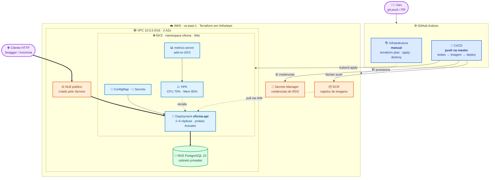

# Oficina API - Tech Challenge

Backend monolítico para gestão de Oficina Mecânica, desenvolvido com **Java 21 + Spring Boot 4 + PostgreSQL**.

## Fase 2 — objetivo desta fase

Na Fase 1 o foco foi o domínio (OS, clientes, veículos, peças). Nesta Fase 2 o
objetivo é evoluir a base para suportar **maior demanda e múltiplas unidades**
com resiliência e escalabilidade, incorporando:

- Containerização revisada (Docker/Docker Compose).
- Orquestração via Kubernetes na AWS — EKS (Deployments, Services, ConfigMaps/Secrets, HPA).
- Infraestrutura como código via Terraform (VPC, cluster EKS, ECR e banco RDS).
- Pipeline de CI/CD (build, testes, imagem Docker no ECR, deploy no EKS).

A seção [Infraestrutura e Deploy](#infraestrutura-e-deploy) detalha os
componentes provisionados e como executar cada etapa.

---

## Pré-requisitos

- Java 21+
- Docker e Docker Compose
- Maven (ou use o wrapper `./mvnw` incluso no projeto)

---

## Subindo o ambiente

### 0. (Opcional) Customizar credenciais locais

```bash
cp .env.example .env
```

O `docker-compose.yml` lê as variáveis do `.env` (se não existir, usa os
defaults abaixo). O `.env` é ignorado pelo git.

### 1. Iniciar o banco de dados

```bash
docker-compose up -d db
```

Isso sobe um container PostgreSQL com as credenciais padrão:
- **Host:** `localhost:5432`
- **Banco:** `oficina_db`
- **Usuário:** `oficina_user`
- **Senha:** `oficina_123`

### 2. Iniciar a aplicação

```bash
./mvnw spring-boot:run
```

Alternativamente, `docker-compose up -d` sobe banco **e** aplicação
containerizados (usa o `Dockerfile` multi-stage do projeto).

O Flyway executa as migrations automaticamente na inicialização. A aplicação fica disponível em `http://localhost:8080`.

### 3. (Opcional) Visualizar e-mails com o Mailhog

O `docker-compose.yml` também sobe um serviço `mailhog` — um servidor SMTP
falso para desenvolvimento local. Ele **não envia e-mails de verdade**: toda
notificação disparada pela aplicação (via outbox, a cada mudança de status da
OS) é capturada por ele e exibida em uma UI web, em vez de ir para uma caixa
de entrada real.

> Mailhog/SMTP é usado apenas em desenvolvimento local. Em produção o envio
> de e-mail usa Amazon SES via o profile `ses` — ver
> [Configuração de e-mail em produção (Amazon SES)](#configuração-de-e-mail-em-produção-amazon-ses).

```bash
docker-compose up -d mailhog
```

- **SMTP (usado pela aplicação):** `localhost:1025` — já é o default de
  `SMTP_HOST`/`SMTP_PORT` no `application.yml`, então nenhuma configuração
  extra é necessária.
- **UI web (para inspecionar os e-mails capturados):** http://localhost:8025

Para testar: dispare qualquer ação que gere notificação (ex.: uma mudança de
status de OS) e abra a UI do Mailhog em `http://localhost:8025` — o e-mail
capturado aparece na lista, com assunto, corpo e destinatário, sem precisar de
nenhuma conta de e-mail real.

---

## Usando o Swagger

Com a aplicação rodando, acesse:

**http://localhost:8080/swagger-ui/index.html**

Todos os endpoints (exceto `/api/auth/**`) exigem autenticação JWT. Para usar o Swagger:

**Passo 1 — Criar um usuário**

Localize o endpoint `POST /api/auth/register` e execute com:
```json
{
  "email": "admin@oficina.com",
  "senha": "123456"
}
```

**Passo 2 — Fazer login**

Execute `POST /api/auth/login` com as mesmas credenciais. Copie o valor do campo `token` da resposta.

**Passo 3 — Autorizar no Swagger**

1. Clique no botão **Authorize** (cadeado no topo da página)
2. No campo **bearerAuth**, cole o token copiado (apenas o valor, sem o prefixo `Bearer`)
3. Clique em **Authorize** e depois **Close**

A partir deste passo todos os endpoints enviam o JWT automaticamente.

---

## Testando via Insomnia

Importe o arquivo `tests/oficina-api.insomnia.json` no Insomnia.

Configure as variáveis de ambiente da collection:
| Variável | Valor padrão | Descrição |
|---|---|---|
| `base_url` | `http://localhost:8080` | URL base da API |
| `token` | _(vazio)_ | Token JWT — preencher após login |
| `cliente_id` | _(vazio)_ | UUID do cliente cadastrado |
| `veiculo_placa` | `ABC1D23` | Placa para testes |
| `numero_os` | _(vazio)_ | Número da OS criada |
| `numero_orcamento` | _(vazio)_ | Número do orçamento criado |

**Fluxo sugerido:**
1. `POST /api/auth/register` — criar usuário
2. `POST /api/auth/login` — copiar o token para a variável `token`
3. `POST /clientes` — criar cliente, copiar o `id` para `cliente_id`
4. `POST /veiculos` — criar veículo vinculado ao cliente
5. `POST /ordens-servico` — abrir OS, copiar o número para `numero_os`
6. Avançar o fluxo da OS (iniciar diagnóstico → concluir → enviar para orçamento)

---

## Executando os testes

```bash
./mvnw test
```

Esse comando roda toda a suíte. Cobertura mínima de 80% (linhas e branches) é verificada pelo JaCoCo. O build falha se a cobertura não for atingida.

### Testes unitários e de controller

Utilizam **H2 in-memory** — não exigem banco externo nem Docker.

### Testes de integração (PostgreSQL real via Testcontainers)

Os testes `*IntegrationTest` validam os repositórios JPA contra um **PostgreSQL real provisionado automaticamente pelo [Testcontainers](https://testcontainers.com/)**. Basta ter o **Docker em execução** — não é necessário subir o banco manualmente (`docker-compose`) nem apontar para um banco externo em `localhost`. O container é efêmero e descartado ao fim da execução, garantindo que os testes rodem em qualquer máquina/CI com Docker.

Detalhes:
- A classe base `PostgresIntegrationTest` (em `src/test/.../support`) sobe o container `postgres:16-alpine` e injeta o datasource via `@ServiceConnection`.
- Os testes usam `@Transactional` com rollback automático — nenhum dado persiste entre testes.
- Sem Docker disponível, apenas os testes de integração falham ao iniciar o container; os demais continuam rodando normalmente.

### Build completo com relatório de cobertura

```bash
./mvnw verify
```

O relatório HTML é gerado em `target/site/jacoco/index.html`.

---

## Scan de Vulnerabilidades e Qualidade (SonarQube)

O projeto está configurado para consolidar a cobertura de testes do JaCoCo e inspecionar a qualidade do código (code smells, bugs e vulnerabilidades) via **SonarQube**.

**Como executar a varredura:**

1. Certifique-se de que possui um servidor SonarQube rodando. Caso não possua, você pode subir um localmente usando Docker:
   ```bash
   docker run -d --name sonarqube -p 9000:9000 sonarqube:latest
   ```

2. Execute o build junto com os testes para que os relatórios do XML de cobertura do JaCoCo sejam criados (localizados na pasta do `target`):
   ```bash
   ./mvnw clean verify
   ```

3. Dispare a execução do *Sonar Scanner* passando a URL e as credenciais do seu servidor. **Atenção:** Se estiver usando o **PowerShell** no Windows, coloque os parâmetros com `-D` entre aspas para evitar erros de leitura, como no exemplo abaixo:
   ```bash
   ./mvnw sonar:sonar "-Dsonar.host.url=http://localhost:9000" "-Dsonar.token=SEU_TOKEN" "-Dsonar.projectKey=oficina"
   ```

Acesse o painel do seu SonarQube na URL do host para visualizar o nível de cobertura, a aba de "Security" e demais métricas de vulnerabilidade do projeto.

---

## Autenticação JWT

Todas as rotas exceto `/api/auth/register` e `/api/auth/login` exigem o header:

```
Authorization: Bearer <token>
```

O token expira em **24 horas**. Para renovar, basta fazer login novamente.

---

## Endpoints REST

| Domínio | Endpoints |
|---|---|
| Autenticação (`/api/auth`) | `POST /register`, `POST /login` |
| Clientes (`/clientes`) | `POST`, `GET`, `GET /{clienteId}`, `PUT /{clienteId}`, `DELETE /{clienteId}` |
| Veículos (`/veiculos`) | `POST`, `GET`, `PUT /{placa}`, `DELETE /{placa}` |
| Funcionários (`/funcionarios`) | `POST`, `GET`, `GET /{funcionarioId}`, `PUT /{funcionarioId}`, `DELETE /{funcionarioId}` |
| Ordens de Serviço (`/ordens-servico`) | `POST`, `GET`, `GET /{numeroOrdemServico}`, `PUT /{numeroOrdemServico}`, `DELETE /{numeroOrdemServico}`, `GET /metricas/tempo-medio`, `GET /{numeroOrdemServico}/acompanhamento` |
| Diagnóstico da OS | `POST /ordens-servico/{numeroOrdemServico}/diagnostico/iniciar`, `POST /ordens-servico/{numeroOrdemServico}/diagnostico/concluir`, `POST /ordens-servico/{numeroOrdemServico}/diagnostico/enviar-para-orcamento` |
| Execução e entrega da OS | `POST /ordens-servico/{numeroOrdemServico}/execucao/iniciar`, `POST /ordens-servico/{numeroOrdemServico}/servico/concluir`, `POST /ordens-servico/{numeroOrdemServico}/finalizacao`, `POST /ordens-servico/{numeroOrdemServico}/entrega` |
| Orçamentos (`/orcamentos`) | `POST /{orcamentoId}/aprovacao`, `POST /{orcamentoId}/rejeicao`, `GET /{orcamentoId}`, `GET`, `PUT /{orcamentoId}`, `DELETE /{orcamentoId}` |
| Peças e Insumos (`/pecas-insumos`) | `POST`, `GET`, `GET /{id}`, `PUT /{id}`, `DELETE /{id}`, `POST /{id}/adicionar-estoque`, `POST /{id}/remover-estoque`, `POST /{id}/reservar`, `POST /{id}/liberar-reserva`, `POST /{id}/consumir` |
| Webhook de decisão de orçamento (`/integracoes/orcamentos`) | `POST /{numeroOrcamento}/decisao` — exige o header `X-Webhook-Token`, aceitando um token de integração gerado (ver abaixo) ou o segredo estático `ORCAMENTO_WEBHOOK_SECRET` (coexistência temporária) |
| Tokens de integração (`/integracoes/tokens`) | `POST` (gerar), `GET` (listar), `DELETE /{id}` (revogar) — autenticado via JWT, como as demais rotas |

> **Notificações**: não expõem endpoint REST. São disparadas internamente (padrão outbox) a cada mudança de status da OS e reprocessadas por um scheduler em caso de falha de envio. O transporte de e-mail é resolvido por Spring Profile: SMTP/Mailhog (`SMTP_HOST`/`SMTP_PORT`, default) em desenvolvimento, ou Amazon SES com o profile `ses` em produção — ver [Configuração de e-mail em produção (Amazon SES)](#configuração-de-e-mail-em-produção-amazon-ses).

---

## Estrutura do projeto

```
src/main/java/br/com/oficina/
├── auth/               # JWT stateless — register, login, filtro, SecurityConfig
├── cliente/            # CRUD de clientes (PF/PJ, validacao CPF/CNPJ)
├── veiculo/            # CRUD de veiculos (placa formato antigo e Mercosul)
├── ordemservico/       # Bounded context principal — ciclo de vida da OS
├── orcamento/          # Orcamentos vinculados a OS
├── pecainsumo/         # Estoque de pecas e insumos
├── common/             # Excecoes globais e ApiExceptionHandler
└── config/             # SwaggerConfig, FlywayConfig
```

Arquitetura hexagonal (ports & adapters) com estrutura `domain / application / infrastructure` por módulo.

---

## Infraestrutura e Deploy

### Desenho da arquitetura



**Componentes da aplicação:** API Spring Boot (`oficina-api`, arquitetura
hexagonal — ver [Estrutura do projeto](#estrutura-do-projeto)) + PostgreSQL.

**Infraestrutura provisionada (Terraform, [`infra/aws`](infra/README.md)):**
VPC com subnets públicas/privadas/de banco em 2 AZs, cluster **EKS** com
node group gerenciado (2–4× t3.medium) e metrics-server, registry **ECR**,
banco **RDS PostgreSQL 15** com credenciais gerenciadas pelo Secrets Manager,
e uma **IAM Role/Policy para SES** (`infra/aws/ses.tf`, permissão única
`ses:SendEmail`, assumível via IRSA pelo `ServiceAccount` `oficina-api`).

**Fluxo de deploy:** push na `master` → build + testes (unitário e
integração) → imagem Docker publicada no **ECR** (tag = sha do commit) →
job de deploy aponta o `kubectl` para o EKS, materializa o Secret do banco a
partir do Secrets Manager, injeta imagem/endpoint nos manifestos de `/k8s` e
aplica, validando o rollout. A infraestrutura em si é provisionada à parte
pelo workflow **Infraestrutura (Terraform)**, manual, porque criar EKS leva
~15 min.

### Containerização (Docker)

- `Dockerfile`: build multi-stage (Maven → JRE 21 Alpine), usuário não-root,
  `HEALTHCHECK` via `/actuator/health/liveness` (Spring Boot Actuator, público).
- `docker-compose.yml`: sobe banco + aplicação para desenvolvimento local
  (ver [Subindo o ambiente](#subindo-o-ambiente)).

### Kubernetes (`/k8s`)

| Arquivo | Recurso |
|---|---|
| `00-namespace.yaml` | Namespace `oficina` |
| `00b-serviceaccount.yaml` | ServiceAccount `oficina-api`, anotada com `eks.amazonaws.com/role-arn` (placeholder `__SES_IAM_ROLE_ARN__`) para IRSA — usada pelo `SesClient` em produção |
| `01-configmap.yaml` | `DB_URL` (placeholder `__RDS_ENDPOINT__`, preenchido pela pipeline com o endpoint do RDS); `AWS_SES_REGION`/`AWS_SES_REMETENTE` (placeholder `__AWS_SES_REMETENTE__`) |
| `02-secret.yaml` | `JWT_SECRET` e `ORCAMENTO_WEBHOOK_SECRET` (valores de demo — ver comentário no arquivo) |
| `03-deployment.yaml` | Deployment da API (placeholder `__IMAGE__` → ECR), 2 réplicas, probes, requests/limits, `serviceAccountName: oficina-api`, `SPRING_PROFILES_ACTIVE=ses` |
| `04-service.yaml` | Service `LoadBalancer` — a AWS cria um NLB público para a demo |
| `05-hpa.yaml` | HorizontalPodAutoscaler (2-6 réplicas, 70% CPU / 80% memória) |

As credenciais do banco **não estão no repositório**: o RDS as gerencia no
Secrets Manager, e o job de deploy cria o Secret `oficina-db-credentials` no
cluster a cada deploy. Os comandos para aplicar manualmente (substituição dos
placeholders) estão comentados nos próprios manifestos.

### Infraestrutura como código (Terraform, `/infra/aws`)

Recursos criados, custos estimados, bootstrap do state (S3) e instruções de
apply/destroy: **[`infra/README.md`](infra/README.md)**.

```bash
cd infra/aws
terraform init -backend-config=backend.hcl
terraform apply    # VPC + EKS + ECR + RDS (~15-20 min)
```

> ⚠️ Custo: ~US$ 0,27/h com tudo ligado. Aplique quando for usar e destrua
> depois (`terraform destroy` — ver ordem correta no infra/README).

### CI/CD (`.github/workflows/`)

**Secrets/variables do repositório** (Settings → Secrets and variables → Actions):
`AWS_ACCESS_KEY_ID` e `AWS_SECRET_ACCESS_KEY` (secrets), `TF_STATE_BUCKET` e
opcionalmente `AWS_REGION` (variables).

**`infra.yml` — Infraestrutura (Terraform)**, manual (*Run workflow*):
`plan`, `apply` ou `destroy` da infraestrutura AWS, com state remoto no S3.
No `destroy`, remove antes os recursos do k8s (o NLB é criado fora do
Terraform e travaria a exclusão da VPC).

**`ci-cd.yml` — CI/CD**, em push na `master` e PRs para `master`/`desenvolvimento`:

1. **unit-tests** — `./mvnw clean verify` (build + testes unitários + gate de cobertura JaCoCo).
2. **integration-tests** — `./mvnw test -Dspring.profiles.active=integration` contra um PostgreSQL real (service container).
3. **build-image** — build e push da imagem para o **ECR** (tags: sha do commit e `latest`) — só em push, nunca em PR.
4. **deploy** — `aws eks update-kubeconfig`, cria o Secret do banco a partir do Secrets Manager, injeta imagem/endpoint nos manifestos e `kubectl apply -f k8s/`, aguardando o rollout e imprimindo a URL pública do NLB.

## Variáveis de ambiente

| Variável | Padrão |
|---|---|
| `DB_URL` | `jdbc:postgresql://localhost:5432/oficina_db` |
| `DB_USER` | `oficina_user` |
| `DB_PASS` | `oficina_123` |
| `JWT_SECRET` | chave hardcoded de fallback |
| `SPRING_PROFILES_ACTIVE` | não definido (SMTP/Mailhog); `ses` ativa o envio via Amazon SES em produção |
| `AWS_SES_REGION` | *(apenas com profile `ses`)* região AWS do SES, ex. `us-east-1` |
| `AWS_SES_REMETENTE` | *(apenas com profile `ses`)* endereço remetente, já verificado no SES |

## Configuração de e-mail em produção (Amazon SES)

Em produção (Kubernetes, `k8s/`), o envio de e-mail é feito por `NotificadorEmailSes`,
ativado pelo Spring Profile `ses` (ver `SPRING_PROFILES_ACTIVE` em
[`03-deployment.yaml`](k8s/03-deployment.yaml)). Em desenvolvimento local
(`docker-compose.yml`) esse profile não é definido e a aplicação continua usando
`NotificadorEmailSpringMail` contra o Mailhog — nenhum dos dois ambientes precisa
de configuração adicional para manter seu comportamento atual.

**Variáveis do profile `ses`:**

- `AWS_SES_REGION` — região AWS do SES (ex. `us-east-1`), configurada no `ConfigMap` (`01-configmap.yaml`).
- `AWS_SES_REMETENTE` — endereço de e-mail remetente, configurado no mesmo `ConfigMap` (placeholder `__AWS_SES_REMETENTE__`, substituído pela pipeline ou manualmente).

**Pré-requisitos antes do primeiro deploy do profile `ses`:**

1. **Verificação de domínio ou endereço no console do Amazon SES** — o remetente que for
   configurado em `AWS_SES_REMETENTE` (passo 3 abaixo) precisa estar verificado na conta AWS/região
   usada (`us-east-1`); sem isso o SES rejeita o envio. Esta é uma ação manual no console AWS, fora
   deste repositório.
2. **Decisão sandbox vs. saída do sandbox** — contas novas do SES operam em modo sandbox (só
   enviam para endereços/domínios *também* verificados). Para testar, use o
   [mailbox simulator do SES](https://docs.aws.amazon.com/ses/latest/dg/send-an-email-from-console.html#send-email-simulator)
   (ex. `success@simulator.amazonses.com`) ou destinatários verificados manualmente. Para enviar a
   destinatários arbitrários em produção, solicite a saída do sandbox à AWS.

**Infraestrutura automatizada (nada manual a partir daqui):**

3. **IAM Role via IRSA, provisionada pelo Terraform** — `infra/aws/ses.tf` cria uma IAM Policy
   (permissão única `ses:SendEmail`) e uma IAM Role assumível pelo `ServiceAccount` `oficina-api`
   via IRSA, expondo o ARN como `output "ses_role_arn"`. O `SesClient` resolve essas credenciais
   automaticamente via `DefaultCredentialsProvider` — nenhuma credencial estática é armazenada em
   Secret do Kubernetes.
4. **Placeholders substituídos automaticamente no deploy** — o job `deploy` de
   [`ci-cd.yml`](.github/workflows/ci-cd.yml) descobre o ARN da Role via
   `aws iam get-role --role-name oficina-ses-send-email` e substitui `__SES_IAM_ROLE_ARN__` em
   [`00b-serviceaccount.yaml`](k8s/00b-serviceaccount.yaml); e substitui `__AWS_SES_REMETENTE__` em
   `01-configmap.yaml` pela variável de repositório `AWS_SES_REMETENTE` (GitHub → Settings →
   Secrets and variables → Actions → *Variables*). Se essa variável não estiver configurada, o job
   falha explicitamente em vez de aplicar um manifesto quebrado.

**Runbook — ordem de operações para habilitar o profile `ses` pela primeira vez:**

```
1. Verificar o domínio/endereço remetente no console do Amazon SES        (passo 1, manual)
2. terraform apply em infra/aws (ou workflow "Infraestrutura (Terraform)") (cria a IAM Role)
3. Configurar a variável de repositório AWS_SES_REMETENTE no GitHub       (passo manual, uma vez)
4. Merge/push para master                                                (job "deploy" aplica tudo)
```

### Rollback

Se o envio via SES apresentar problemas em produção, o rollback é reverter para o
transporte SMTP/Mailhog anterior:

1. Remover (ou definir como vazio) `SPRING_PROFILES_ACTIVE=ses` em
   [`03-deployment.yaml`](k8s/03-deployment.yaml) — isso faz `NotificadorEmailSpringMail`
   (`@Profile("!ses")`) voltar a ser o bean resolvido.
2. Reaplicar o manifesto (`kubectl apply -f k8s/03-deployment.yaml` ou via pipeline) e
   confirmar o rollout (`kubectl rollout status deployment/oficina-api -n oficina`).
3. Nenhuma outra alteração é necessária: `ConfigMap`, `Secret` e `ServiceAccount`
   permanecem inertes sem o profile `ses` ativo (a configuração SMTP em
   `01-configmap.yaml` já está sempre presente).

Reverter a infraestrutura (`infra/aws/ses.tf`) é independente e opcional: remover o arquivo e
rodar `terraform apply` (ou `terraform destroy -target=aws_iam_role.ses_send_email` pontualmente)
não afeta o profile padrão (`!ses`/Mailhog) nem nenhum outro recurso — a Role só é referenciada
pelo profile `ses`.
