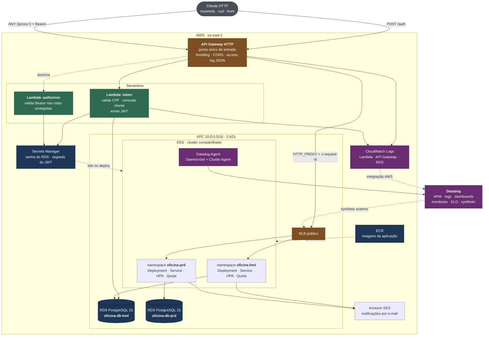
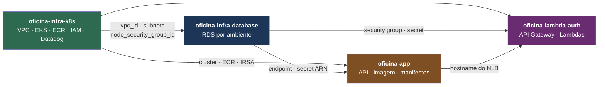

# Diagrama de Componentes

Visão de nuvem do sistema: quem são os componentes, o que cada um faz, quem os
provisiona e por onde o tráfego passa.

> Para a visão **interna** da aplicação (arquitetura hexagonal, controllers,
> services e repositórios), veja [`../fluxograma.md`](../fluxograma.md). Este
> documento para na fronteira do processo Java — o que está **dentro** dele é
> assunto do outro.

## Visão geral

## Componentes

| Componente | Responsabilidade | Provisionado por |
|---|---|---|
| **API Gateway HTTP** | Entrada única. Roteia `POST /auth` para a Lambda e todo o resto para o NLB, aplicando o authorizer. Throttling por ambiente e access log JSON com `requestId` e latência | `oficina-lambda-auth` |
| **Lambda `token`** | Valida o CPF por dígito verificador, consulta existência e status do cliente no RDS e emite um JWT HS256. Roda **dentro** da VPC para alcançar o banco | `oficina-lambda-auth` |
| **Lambda `authorizer`** | Valida o `Bearer` antes da requisição chegar ao cluster. Roda **fora** da VPC: só precisa do Secrets Manager, e uma ENI por container somaria cold start no caminho crítico | `oficina-lambda-auth` |
| **NLB** | Expõe o `Service` da aplicação. Criado pelo Kubernetes, **fora do Terraform** | Kubernetes (repo `oficina-app`) |
| **EKS** | Cluster compartilhado entre os ambientes, separados por namespace. Add-on `metrics-server` alimenta o HPA | `oficina-infra-k8s` |
| **RDS PostgreSQL** | Uma instância por ambiente, em subnets de banco, sem acesso público. Porta 5432 aberta apenas para o security group dos nodes e o da Lambda | `oficina-infra-database` |
| **ECR** | Registry das imagens, com scan on push e retenção das 20 mais recentes | `oficina-infra-k8s` |
| **Secrets Manager** | Senha do RDS (gerada e custodiada pela AWS) e segredo HMAC do JWT. Nenhum dos dois passa por código ou state | `oficina-infra-database` / `oficina-lambda-auth` |
| **SES** | Envio das notificações de mudança de status da OS, via IRSA — sem credencial estática no cluster | IAM em `oficina-infra-k8s`; verificação do remetente é manual |
| **CloudWatch Logs** | Logs da Lambda, access log do gateway e logs do PostgreSQL | cada repositório, com retenção por ambiente |
| **Datadog** | APM, coleta de logs, dashboards, 8 monitores, SLO e teste sintético de uptime | `oficina-infra-k8s` |

## Fronteiras que valem atenção

**O NLB é público.** A rota proxy do gateway aponta para ele, mas ele também é
alcançável diretamente. Foi decisão consciente de custo e simplicidade — a
alternativa era VPC Link com NLB interno. A mitigação possível sem VPC Link é
exigir um header injetado pelo gateway e recusado pela aplicação quando ausente.
Está registrado em
[`oficina-lambda-auth/docs/adr/0001`](https://github.com/soat13-oficina/oficina-lambda-auth/blob/master/docs/adr/0001-api-gateway-e-autorizacao.md).

**A plataforma é compartilhada entre ambientes.** VPC, cluster e ECR são um só;
a segregação acontece por namespace e por instância de banco. A decisão, o custo
e as alternativas descartadas estão em
[`oficina-infra-k8s/docs/adr/0002`](https://github.com/soat13-oficina/oficina-infra-k8s/blob/master/docs/adr/0002-plataforma-compartilhada.md).

**A correlação atravessa os três componentes.** O `requestId` gerado pelo API
Gateway aparece no access log dele, no log estruturado da Lambda e, propagado
pelo header `x-request-id`, no log da aplicação. Uma requisição inteira se
reconstrói com uma única busca.

## Cadeia de provisionamento

Os quatro repositórios não são independentes: cada camada lê o *state* da
anterior via `terraform_remote_state`.

Ordem de aplicação: **`infra-k8s` → `infra-database` → `oficina-app` → `oficina-lambda-auth`**.
Ordem de destruição: exatamente a inversa. A aplicação vem antes da Lambda por
dois motivos — ela cria o NLB que o gateway usa como destino, e roda a migration
que cria a coluna `clientes.ativo`, consultada pela função de token.
