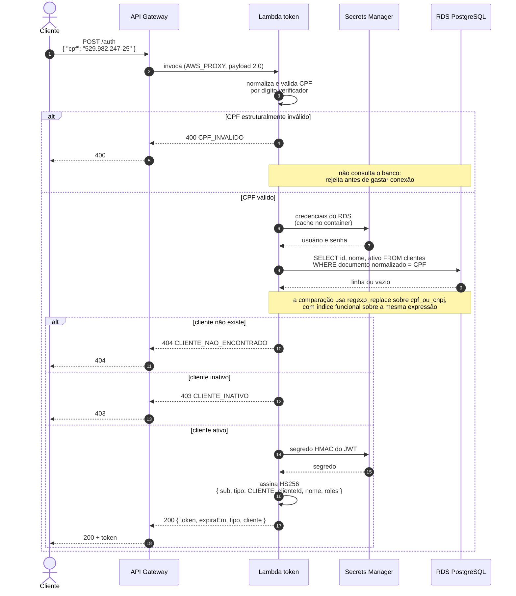
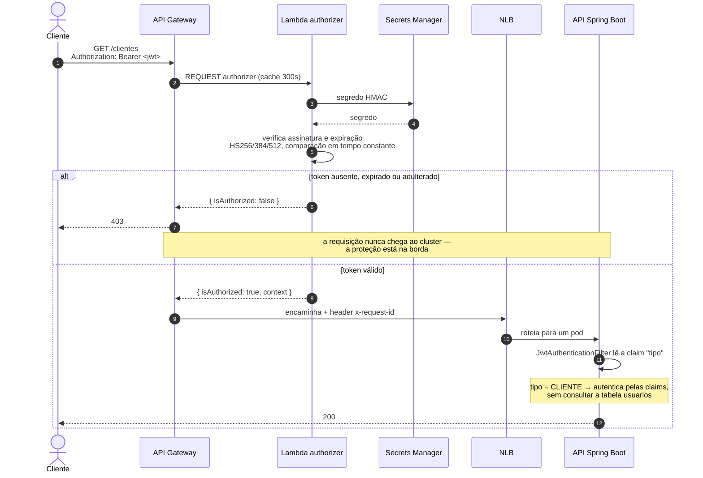
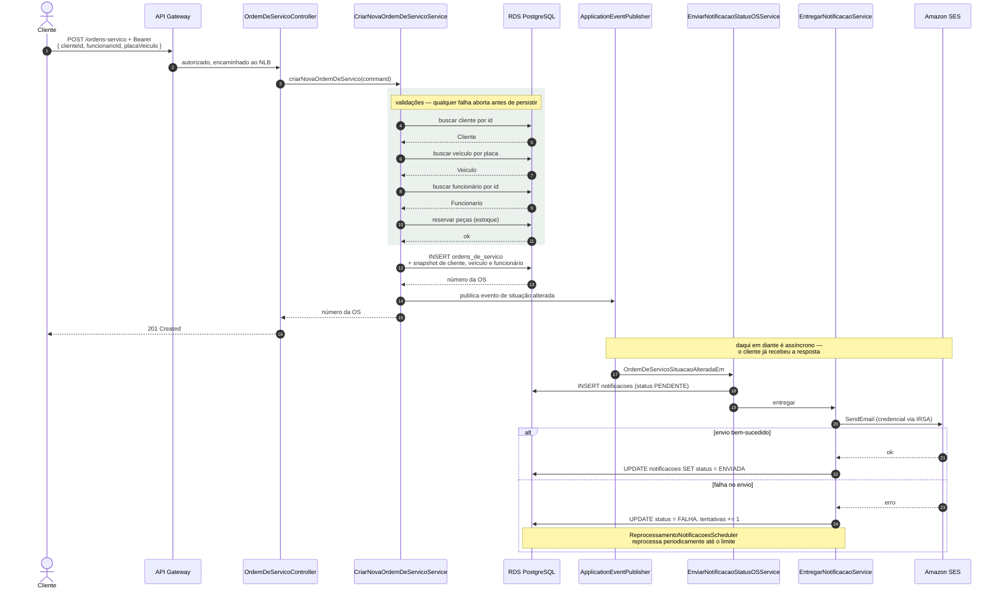

# Diagramas de Sequência

Os dois fluxos que o enunciado pede: **autenticação por CPF** e **abertura de
ordem de serviço**. Ambos refletem o código como ele está, não como se pretendia
que fosse.

---

## 1 · Autenticação por CPF

Trocar um CPF por um token que as rotas protegidas aceitam. O cliente **não tem
senha** — a posse do CPF de um cliente ativo é a credencial.

**Por que a consulta normaliza na leitura.** A coluna `cpf_ou_cnpj` guarda o
documento **como foi digitado** — o domínio valida por dígito verificador mas
persiste a string original, então o mesmo CPF pode estar gravado como
`529.982.247-25` ou `52998224725`. Sem o `regexp_replace` a busca por dígitos não
encontraria o primeiro. Há um índice funcional sobre a mesma expressão, então
não cai em *sequential scan* — ver [`modelo-de-dados.md`](modelo-de-dados.md).

### Consumo de rota protegida

O token emitido acima atravessa duas validações independentes, com o **mesmo
segredo HMAC** e propósitos diferentes.

**Duas validações não é redundância.** O authorizer protege a **borda** — sem
ele a requisição chegaria ao cluster antes de ser recusada. O filtro da
aplicação estabelece a **identidade** no contexto de segurança do Spring, que é
o que permite a autorização por papel dentro do domínio. Um cobre o que o outro
não faz.

**Por que a claim `tipo`.** A aplicação tem um segundo fluxo de autenticação, por
e-mail e senha, cujo token traz o e-mail no `sub` e resolve o usuário na tabela
`usuarios`. O token de CPF traz `tipo: "CLIENTE"`, e por essa claim o filtro
monta a autenticação a partir das próprias claims — um cliente não é usuário do
sistema e exigir que fosse seria acoplamento desnecessário.

---

## 2 · Abertura de ordem de serviço

Da requisição autenticada até a notificação no e-mail do cliente. O trecho de
notificação é **assíncrono**: segue o padrão *outbox*, com persistência antes do
envio e reprocessamento agendado.

### Decisões visíveis neste fluxo

**A OS grava um *snapshot* do cliente, do veículo e do funcionário**, além das
chaves estrangeiras. Uma ordem de serviço é documento histórico: renomear um
cliente hoje não pode reescrever o que foi emitido no ano passado. É
denormalização deliberada — registrada em
[`../adr/0002-snapshot-em-ordens-e-orcamentos.md`](../adr/0002-snapshot-em-ordens-e-orcamentos.md).

**A notificação é persistida antes de ser enviada.** Se o SES estiver fora do ar,
a linha fica em `PENDENTE`/`FALHA` com contador de tentativas, e o scheduler
reprocessa. A abertura da OS **não falha** porque o e-mail falhou — são
transações separadas, e é isso que o padrão outbox compra.

**O evento só é publicado quando a situação muda de fato.** Duas situações
internas podem mapear para o mesmo status externo (`DIAGNOSTICO_EM_ANDAMENTO` e
`DIAGNOSTICO_CONCLUIDO` viram "Diagnóstico"); publicar nos dois casos geraria
e-mail duplicado. A comparação `situacaoAnterior != situacaoAtual` em
`ConcluirDiagnosticoService` é o que evita isso.

**As peças são reservadas antes da OS existir.** Se a reserva falhar por estoque
insuficiente, nada é persistido. O inverso — criar a OS e depois descobrir que
não há peça — deixaria ordem órfã.
