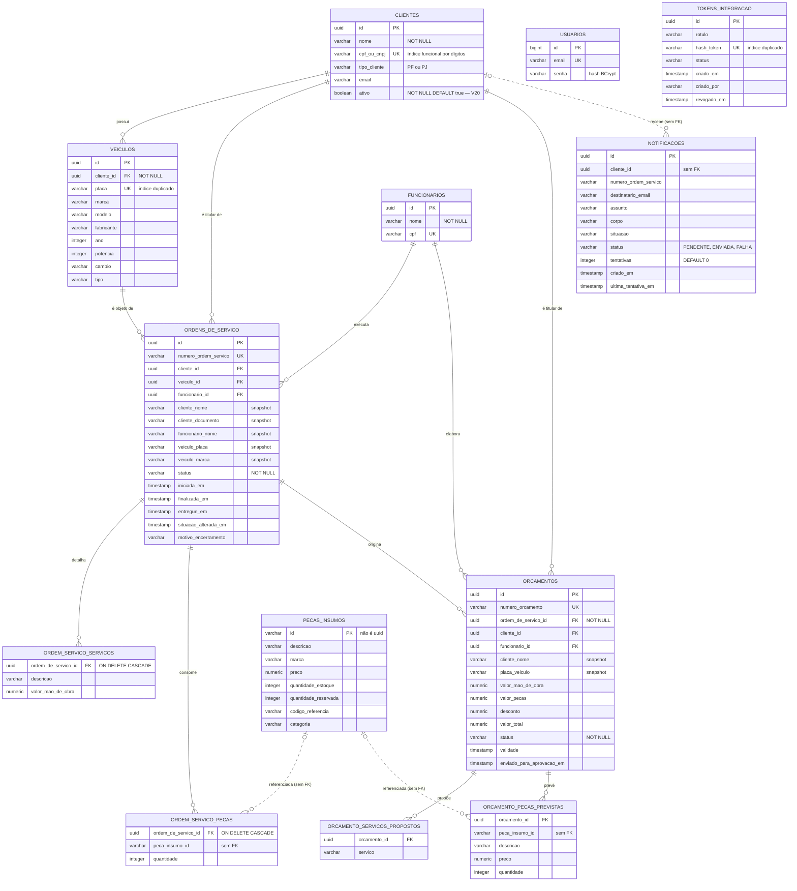

# Modelo de Dados

Diagrama ER, explicação dos relacionamentos, justificativa da escolha do banco e
os ajustes feitos e propostos no modelo relacional.

O schema descrito aqui foi **extraído de um PostgreSQL 15 real**, aplicando as 20
migrations do Flyway em ordem e lendo o `information_schema` — não foi inferido
das entidades JPA. Constraints, índices e nulidade correspondem ao que existe em
produção.

---

## Diagrama ER



`USUARIOS` e `TOKENS_INTEGRACAO` não se relacionam com o domínio de propósito:
são credenciais de acesso (login por e-mail e senha; token de webhook de
orçamento), não entidades de negócio.

---

## Explicação dos relacionamentos

### Cliente é a raiz

Um **cliente** possui N **veículos**, e é titular de N **ordens de serviço** e N
**orçamentos**. A cardinalidade é 1:N em todos os casos — não existe veículo sem
dono nem OS sem cliente, e `cliente_id` é `NOT NULL` nas três tabelas.

`cpf_ou_cnpj` é `UNIQUE`, o que modela a regra "um documento, um cliente". A
constraint tem uma limitação real descrita adiante.

### A ordem de serviço é o agregado central

Ela referencia **cliente**, **veículo** e **funcionário**, e possui duas listas
filhas com `ON DELETE CASCADE`:

- `ordem_servico_servicos` — serviços executados, com a mão de obra de cada um
- `ordem_servico_pecas` — peças consumidas, com quantidade

O `CASCADE` é correto aqui: um serviço executado não existe fora da OS que o
contém. É composição, não associação.

### Orçamento pende da ordem de serviço

`orcamentos.ordem_de_servico_id` é `NOT NULL`: não há orçamento avulso. A
cardinalidade é 1:N — uma OS pode acumular vários orçamentos ao longo do
diagnóstico, e `numero_orcamento` é único. Suas duas listas filhas
(`orcamento_servicos_propostos`, `orcamento_pecas_previstas`) seguem o mesmo
padrão das da OS, mas **sem `CASCADE`**, que é uma inconsistência apontada abaixo.

### Peças são referenciadas, não relacionadas

`ordem_servico_pecas.peca_insumo_id` e `orcamento_pecas_previstas.peca_insumo_id`
apontam para `pecas_insumos.id`, mas **não existe chave estrangeira**. O tipo
também diverge: `varchar` aqui, `varchar` lá — e `pecas_insumos.id` é o único PK
do schema que não é `uuid`.

O controle de estoque vive em `quantidade_estoque` e `quantidade_reservada`, com
reserva feita na abertura da OS e liberada no cancelamento.

### Notificação é um outbox

`notificacoes` não é entidade de negócio: é a fila de entrega de e-mail. Guarda o
conteúdo já renderizado (`assunto`, `corpo`), o `status` e um contador de
`tentativas`, com índice em `(status, tentativas)` — exatamente o que o
reprocessador consulta. O `cliente_id` está lá por rastreabilidade, sem FK.

---

## Justificativa da escolha do banco

A decisão completa, com as alternativas avaliadas e descartadas, está em
[**RFC 0002 — Escolha do banco de dados**](../rfc/0002-escolha-do-banco-de-dados.md).
Em resumo:

**Relacional, e não documento.** O domínio é fortemente relacional — cliente,
veículo, funcionário, OS, orçamento, peça e estoque se cruzam em quase toda
consulta. Modelar isso em documentos exigiria duplicar dados e resolver junções
na aplicação, trocando garantias do banco por código.

**Transações importam.** Abrir uma OS reserva estoque e persiste a ordem. Ou as
duas coisas acontecem, ou nenhuma. Transação ACID entrega isso sem esforço;
consistência eventual exigiria compensação manual.

**PostgreSQL, e não MySQL ou SQL Server.** Tipo `uuid` nativo (usado em 8 dos 9
PKs), `numeric` exato para valores monetários, índices funcionais — que é
exatamente o recurso que resolveu a busca por CPF normalizado —, e licença sem
custo.

**RDS gerenciado, e não contêiner no cluster.** O enunciado exige banco
gerenciado, e a razão técnica acompanha: backup, patch, failover e credencial
rotacionável saem de graça. Postgres em pod no mesmo EKS colocaria o dado no
mesmo domínio de falha da aplicação.

---

## Ajustes no modelo relacional

### Aplicados nesta fase

| Migration | Ajuste | Motivo |
|---|---|---|
| `V20` | Coluna `clientes.ativo` (`NOT NULL DEFAULT TRUE`) | O modelo não tinha noção de status, só de existência. Sem ela era impossível atender "consultar a existência **e o status** do cliente" sem redefinir status como existência |
| `V20` | Índice funcional `idx_clientes_documento_digitos` sobre `regexp_replace(cpf_ou_cnpj, '\D', '', 'g')` | A autenticação busca por dígitos, mas a coluna guarda o documento como foi digitado. Sem o índice, toda tentativa de login seria *sequential scan* |

### Propostos — verificados, não aplicados

O levantamento abaixo saiu de consultas ao `pg_constraint` e `pg_indexes` do
schema real, não de leitura de código.

**1 · Sete chaves estrangeiras sem índice** — no PostgreSQL, FK **não** cria
índice automaticamente. Toda consulta "veículos do cliente X" ou "ordens do
cliente X" é *sequential scan* hoje, e cada `DELETE` no lado pai varre a tabela
filha inteira para checar a constraint.

```sql
CREATE INDEX idx_veiculos_cliente_id            ON veiculos (cliente_id);
CREATE INDEX idx_ordens_cliente_id              ON ordens_de_servico (cliente_id);
CREATE INDEX idx_ordens_veiculo_id              ON ordens_de_servico (veiculo_id);
CREATE INDEX idx_ordens_funcionario_id          ON ordens_de_servico (funcionario_id);
CREATE INDEX idx_orcamentos_cliente_id          ON orcamentos (cliente_id);
CREATE INDEX idx_orc_servicos_orcamento_id      ON orcamento_servicos_propostos (orcamento_id);
CREATE INDEX idx_orc_pecas_orcamento_id         ON orcamento_pecas_previstas (orcamento_id);
```

É o ajuste de maior impacto e menor risco da lista.

**2 · Dois índices únicos duplicados** — `veiculos.placa` tem
`uk_veiculos_placa` **e** `veiculos_placa_key`; `tokens_integracao.hash_token`
tem `idx_tokens_integracao_hash` **e** `tokens_integracao_hash_token_key`. Índice
duplicado custa escrita e espaço sem entregar leitura nenhuma.

```sql
DROP INDEX veiculos_placa_key;
DROP INDEX idx_tokens_integracao_hash;
```

**3 · Quatro tabelas filhas sem chave primária** —
`ordem_servico_servicos`, `ordem_servico_pecas`, `orcamento_servicos_propostos` e
`orcamento_pecas_previstas`. Sem PK não há como referenciar uma linha
individualmente: corrigir a quantidade de uma peça exige apagar e reinserir o
conjunto, e replicação lógica não funciona. Uma PK composta resolveria a maioria
dos casos.

**4 · `notificacoes.cliente_id` sem chave estrangeira** — a integridade
referencial não é garantida pelo banco. É defensável para uma tabela de outbox
(o registro deve sobreviver mesmo se o cliente for removido), mas merece ser
decisão explícita, e não omissão.

**5 · `peca_insumo_id` sem FK e com tipo divergente** — nem
`ordem_servico_pecas` nem `orcamento_pecas_previstas` referenciam
`pecas_insumos` formalmente. Nada impede hoje gravar uma peça inexistente numa
OS. Resolver exige primeiro unificar o tipo do `pecas_insumos.id`, que é o único
PK `varchar` num schema onde todo o resto é `uuid`.

**6 · `CASCADE` inconsistente entre os dois agregados** — as filhas da OS têm
`ON DELETE CASCADE`; as do orçamento não. Como ambas são composições, o
comportamento deveria ser o mesmo.

### Por que não foram aplicados

Os itens 1 e 2 são seguros e teriam entrado nesta fase se o tempo permitisse —
são `CREATE INDEX` e `DROP INDEX`, sem alteração de dado. Os itens 3 a 6 mudam
contrato: exigem decisão de negócio (o que fazer com peça removida que já consta
numa OS emitida) e ajuste nas entidades JPA. Documentá-los com o diagnóstico
pronto vale mais do que aplicá-los às pressas.
