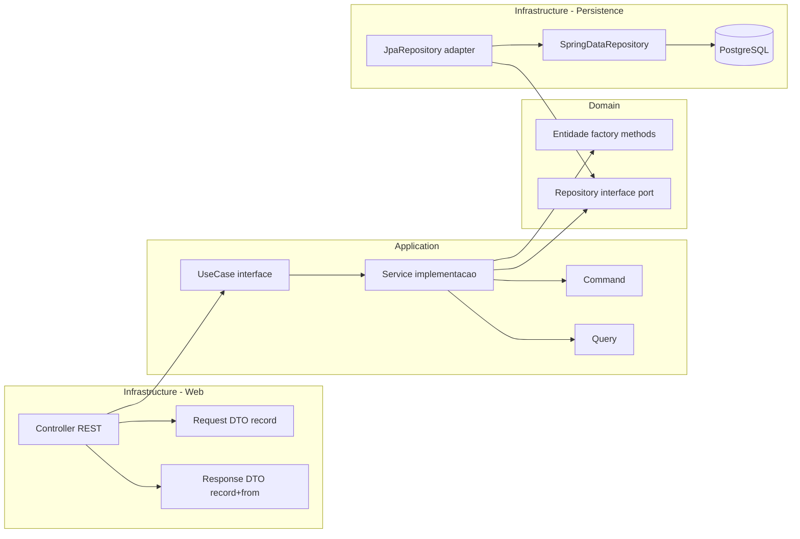
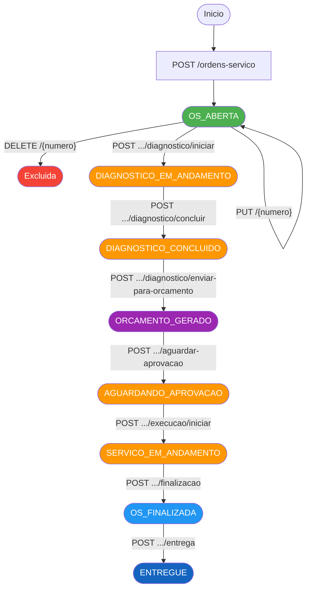
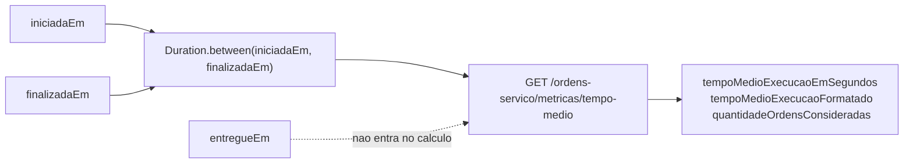
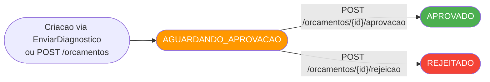
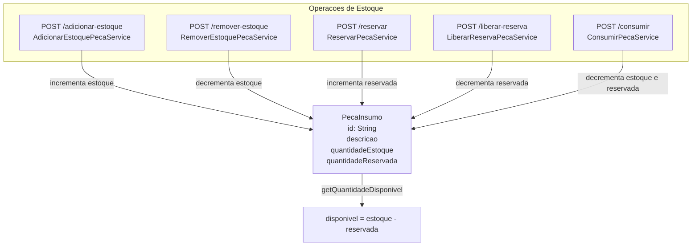
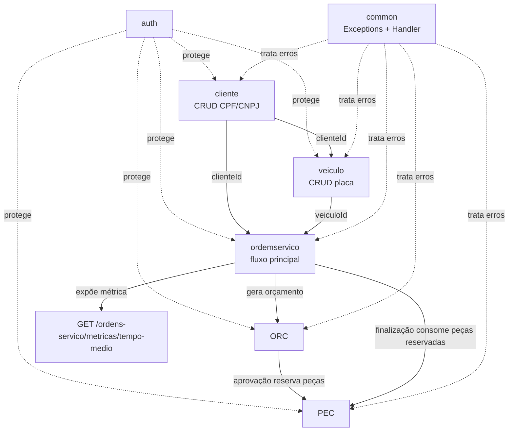

# Fluxograma do Projeto — Oficina API

## 1. Visão Geral da Arquitetura

---

## 2. Arquitetura Hexagonal por Módulo

---

## 3. Ciclo de Vida da Ordem de Serviço

---

## 3.1 Status previstos vs fluxo implementado hoje

O enum `StatusOrdemDeServico` contém os estados abaixo:

- `OS_ABERTA`
- `DIAGNOSTICO_EM_ANDAMENTO`
- `DIAGNOSTICO_CONCLUIDO`
- `AGUARDANDO_ORCAMENTO`
- `ORCAMENTO_GERADO`
- `AGUARDANDO_APROVACAO`
- `ORCAMENTO_APROVADO`
- `SERVICO_EM_ANDAMENTO`
- `AGUARDANDO_PECA`
- `SERVICO_CONCLUIDO`
- `OS_FINALIZADA`
- `ENTREGUE`

As transições efetivamente implementadas no agregado `OrdemDeServico` nesta versão do projeto são:

- `OS_ABERTA -> DIAGNOSTICO_EM_ANDAMENTO`
- `DIAGNOSTICO_EM_ANDAMENTO -> DIAGNOSTICO_CONCLUIDO`
- `DIAGNOSTICO_CONCLUIDO -> ORCAMENTO_GERADO`
- `ORCAMENTO_GERADO -> AGUARDANDO_APROVACAO` (novo passo: cliente precisa aprovar o orçamento)
- `AGUARDANDO_APROVACAO -> SERVICO_EM_ANDAMENTO` (novo passo: orçamento aprovado, execução iniciada)
- `SERVICO_EM_ANDAMENTO -> OS_FINALIZADA`
- `OS_FINALIZADA -> ENTREGUE`

Com isso o fluxo principal passa explicitamente por `AGUARDANDO_APROVACAO` e `SERVICO_EM_ANDAMENTO`, que antes existiam apenas no enum. A finalização agora exige que a ordem esteja em `SERVICO_EM_ANDAMENTO` (não mais diretamente a partir de `ORCAMENTO_GERADO`).

Os estados auxiliares `AGUARDANDO_ORCAMENTO`, `ORCAMENTO_APROVADO`, `AGUARDANDO_PECA` e `SERVICO_CONCLUIDO` continuam previstos no enum para evoluções futuras, mas ainda não possuem transições próprias implementadas no domínio de `OrdemDeServico` nesta revisão.

---

## 3.2 Timestamps e Métrica de Execução

Regras atuais da métrica:

- Considera ordens com `iniciadaEm` e `finalizadaEm` preenchidos.
- Ordens em `OS_FINALIZADA` e `ENTREGUE` entram no cálculo.
- `entregueEm` é apenas informativo para rastrear a entrega ao cliente e não altera a duração de execução.

---

## 4. Ciclo de Vida do Orçamento

---

## 5. Estoque de Peças e Insumos

---

## 6. Módulo de Autenticação

---

## 7. Relacionamento entre Módulos

---

## 8. Mudanças Recentes Registradas no Fluxo

Últimas mudanças incorporadas ao projeto e refletidas neste documento:

- Fechamento do fluxo principal da ordem de serviço com os passos `AGUARDANDO_APROVACAO` e `SERVICO_EM_ANDAMENTO`, expostos pelos endpoints `POST /ordens-servico/{numeroOrdemServico}/aguardar-aprovacao` e `POST /ordens-servico/{numeroOrdemServico}/execucao/iniciar`. A finalização passou a exigir o status `SERVICO_EM_ANDAMENTO`.
- Correção do rollback de reservas na aprovação de orçamento: quando falta estoque para alguma peça, as reservas já feitas são efetivamente liberadas via `LiberarReservaPecaUseCase`, e não mais deixadas presas.
- Validação de CPF/CNPJ do cliente passou a conferir o dígito verificador (biblioteca `caelum-stella`), em vez de apenas contar dígitos.
- Testes de integração de persistência migrados para Testcontainers (PostgreSQL), removendo a dependência de um banco em `localhost`.
- Inclusão da transição `OS_FINALIZADA -> ENTREGUE` com endpoint `POST /ordens-servico/{numeroOrdemServico}/entrega`.
- Persistência do timestamp `entregueEm` na ordem de serviço.
- Inclusão do endpoint `GET /ordens-servico/metricas/tempo-medio`.
- Cálculo da média geral de execução com base em `iniciadaEm` e `finalizadaEm`.
- Atualização do Swagger para documentar entrega ao cliente, métrica de tempo médio e exemplos compatíveis com o fluxo atual.
