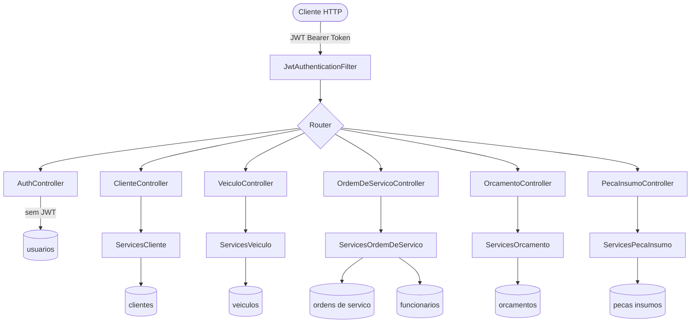
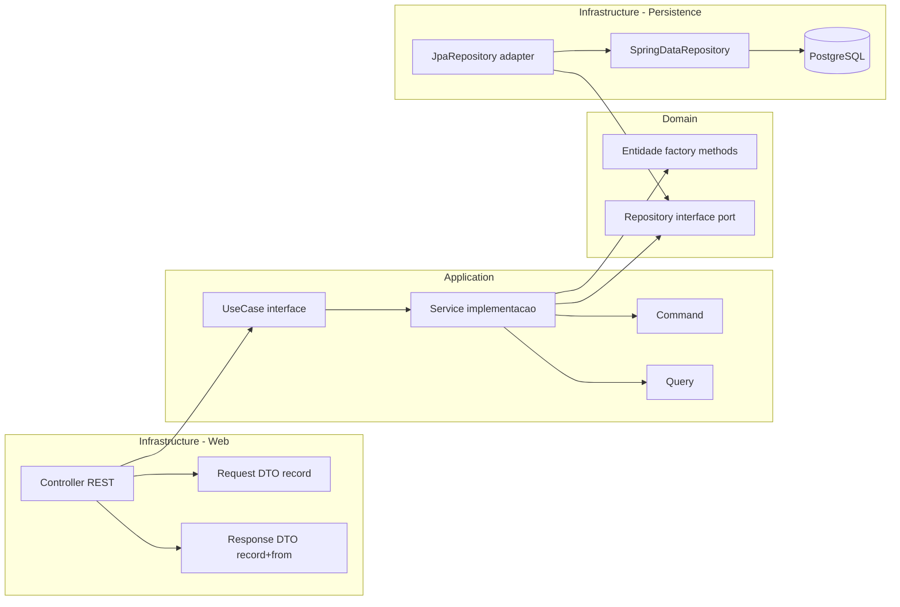
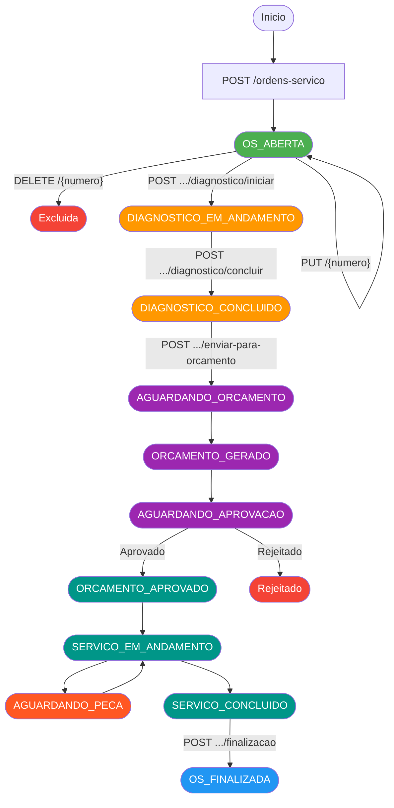
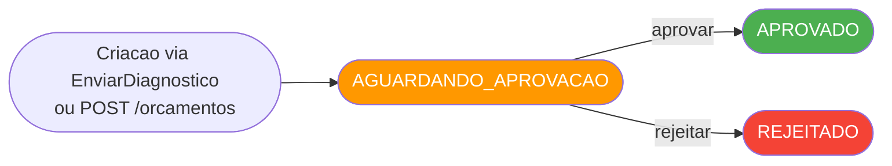
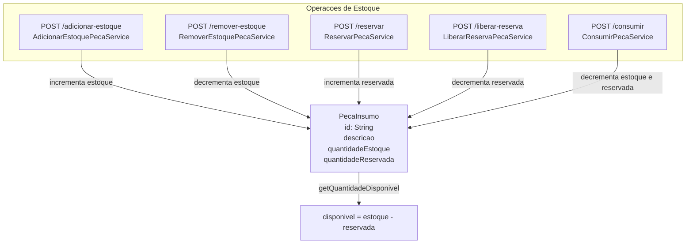
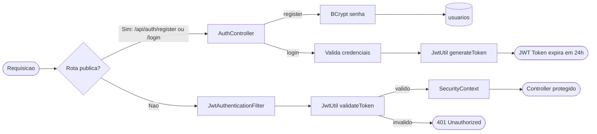
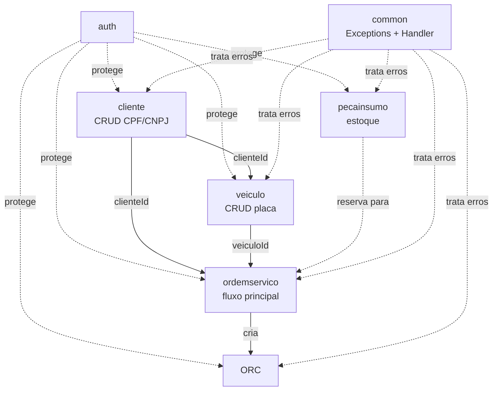

# Fluxograma do Projeto — Oficina API

## 1. Visão Geral da Arquitetura

---

## 2. Arquitetura Hexagonal por Módulo

---

## 3. Ciclo de Vida da Ordem de Serviço

---

## 4. Ciclo de Vida do Orçamento

---

## 5. Estoque de Peças e Insumos

---

## 6. Módulo de Autenticação

---

## 7. Relacionamento entre Módulos

