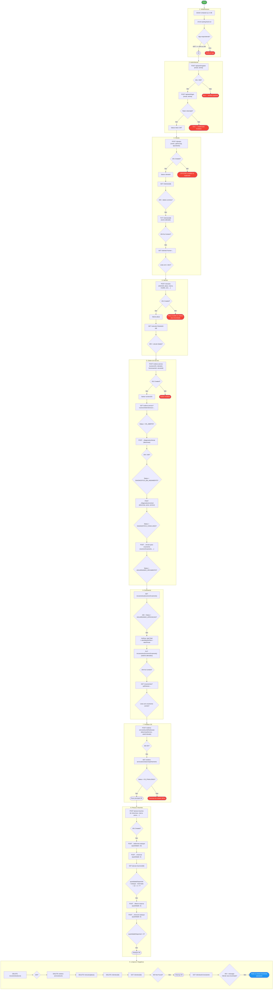

# Teste Funcional — Passo a Passo

## Fluxo Completo

```mermaid
flowchart TD
    START([Inicio]) --> INFRA

    subgraph INFRA["1. Infraestrutura"]
        A1["docker-compose up -d db"] --> A2["./mvnw spring-boot:run"]
        A2 --> A3{App respondendo?}
        A3 -->|"GET / => 404 ou 200"| A4([OK])
        A3 -->|Erro| A5([Verificar logs])
    end

    A4 --> AUTH

    subgraph AUTH["2. Autenticacao"]
        B1["POST /api/auth/register\n{email, senha}"] --> B2{201 / 200?}
        B2 -->|Sim| B3["POST /api/auth/login\n{email, senha}"]
        B2 -->|Nao| B2E([Erro — verificar payload])
        B3 --> B4{Token retornado?}
        B4 -->|Sim| B5[Salvar token JWT]
        B4 -->|Nao| B4E([Erro — credenciais invalidas])
    end

    B5 --> CLI

    subgraph CLI["3. Cliente"]
        C1["POST /clientes\n{nome, cpfOuCnpj, tipoCliente}"] --> C2{201 Created?}
        C2 -->|Sim| C3[Salvar clienteId]
        C2 -->|400| C2E([CPF/CNPJ invalido ou duplicado])
        C3 --> C4["GET /clientes/{id}"]
        C4 --> C5{200 + dados corretos?}
        C5 -->|Sim| C6["PUT /clientes/{id}\n{nome alterado}"]
        C6 --> C7{204 No Content?}
        C7 -->|Sim| C8["GET /clientes?nome=..."]
        C8 --> C9{Lista com 1 item?}
    end

    C9 --> VEI

    subgraph VEI["4. Veiculo"]
        D1["POST /veiculos\n{clienteId, placa, marca,\nmodelo, ano, ...}"] --> D2{201 Created?}
        D2 -->|Sim| D3[Salvar placa]
        D2 -->|400| D2E([Placa invalida ou cliente\nnao encontrado])
        D3 --> D4["GET /veiculos?clienteId={id}"]
        D4 --> D5{200 + veiculo listado?}
    end

    D5 --> OS

    subgraph OS["5. Ordem de Servico"]
        E1["POST /ordens-servico\n{numeroOS, clienteId,\nfuncionarioId, veiculoId}"] --> E2{201 Created?}
        E2 -->|Sim| E3[Salvar numeroOS]
        E2 -->|400| E2E([Dados invalidos])
        E3 --> E4["GET /ordens-servico?numeroOrdemServico=..."]
        E4 --> E5{Status = OS_ABERTA?}
        E5 --> E6["POST .../diagnostico/iniciar\n{descricao}"]
        E6 --> E7{204 / 200?}
        E7 --> E8{Status = DIAGNOSTICO_EM_ANDAMENTO?}
        E8 --> E9["POST .../diagnostico/concluir\n{descricao, peca, servico}"]
        E9 --> E10{Status = DIAGNOSTICO_CONCLUIDO?}
        E10 --> E11["POST .../enviar-para-orcamento\n{numeroOrcamento, ...}"]
        E11 --> E12{Status = AGUARDANDO_ORCAMENTO?}
    end

    E12 --> ORC

    subgraph ORC["6. Orcamento"]
        F1["GET /orcamentos/{numeroOrcamento}"] --> F2{200 + Status = AGUARDANDO_APROVACAO?}
        F2 -->|Sim| F3[Verificar valorTotal\n= valorMaoDeObra + valorPecas]
        F3 --> F4["PUT /orcamentos/{numeroOrcamento}\n{valores alterados}"]
        F4 --> F5{204 No Content?}
        F5 --> F6["GET /orcamentos?cpfCliente=..."]
        F6 --> F7{Lista com orcamento correto?}
    end

    F7 --> FIN

    subgraph FIN["7. Finalizar OS"]
        G1["POST /ordens-servico/{num}/finalizacao\n{descricaoServico, valorCobrado}"] --> G2{200 OK?}
        G2 -->|Sim| G3["GET /ordens-servico/{num}/acompanhamento"]
        G3 --> G4{Status = OS_FINALIZADA?}
        G4 -->|Sim| G5([Fluxo principal OK])
        G4 -->|Nao| G4E([Transicao de estado falhou])
    end

    G5 --> PEC

    subgraph PEC["8. Pecas e Insumos"]
        H1["POST /pecas-insumos\n{id, descricao, marca, preco, ...}"] --> H2{201 Created?}
        H2 -->|Sim| H3["POST .../adicionar-estoque\n{quantidade: 10}"]
        H3 --> H4["POST .../reservar\n{quantidade: 3}"]
        H4 --> H5["GET /pecas-insumos/{id}"]
        H5 --> H6{"quantidadeDisponivel\n= estoque - reservada\n= 10 - 3 = 7?"}
        H6 -->|Sim| H7["POST .../liberar-reserva\n{quantidade: 3}"]
        H7 --> H8["POST .../remover-estoque\n{quantidade: 5}"]
        H8 --> H9{quantidadeDisponivel = 5?}
        H9 -->|Sim| H10([Estoque OK])
    end

    H10 --> CLEAN

    subgraph CLEAN["9. Limpeza e Negativos"]
        I1["DELETE /orcamentos/{num}"] --> I2{204?}
        I2 --> I3["DELETE /ordens-servico/{num}"]
        I3 --> I4["DELETE /veiculos/{placa}"]
        I4 --> I5["DELETE /clientes/{id}"]
        I5 --> I6["GET /clientes/{id}"]
        I6 --> I7{404 Not Found?}
        I7 -->|Sim| I8([Cleanup OK])
        I8 --> I9["GET /clientes/id-inexistente"]
        I9 --> I10{"404 + message:\nCliente nao encontrado?"}
        I10 -->|Sim| END_OK
    end

    END_OK([Todos os testes funcionais passaram])

    style START fill:#4CAF50,color:#fff
    style END_OK fill:#2196F3,color:#fff
    style A5 fill:#f44336,color:#fff
    style B2E fill:#f44336,color:#fff
    style B4E fill:#f44336,color:#fff
    style C2E fill:#f44336,color:#fff
    style D2E fill:#f44336,color:#fff
    style E2E fill:#f44336,color:#fff
    style G4E fill:#f44336,color:#fff
```
